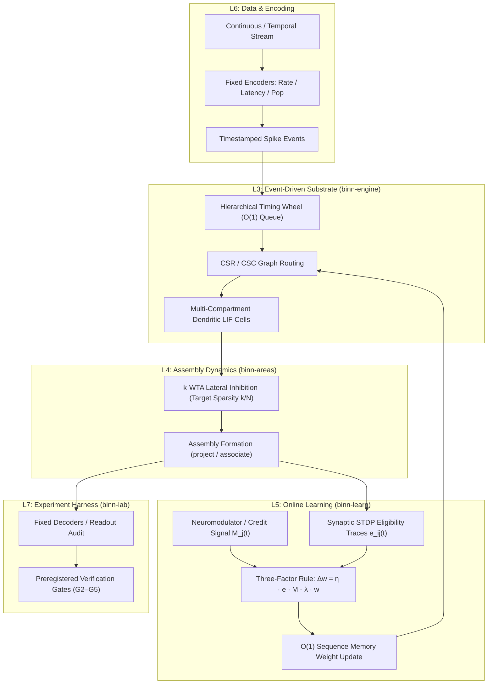
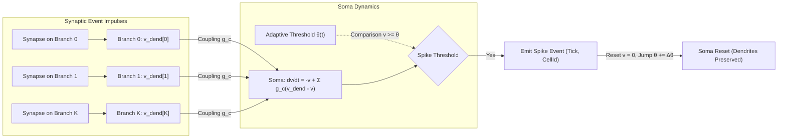
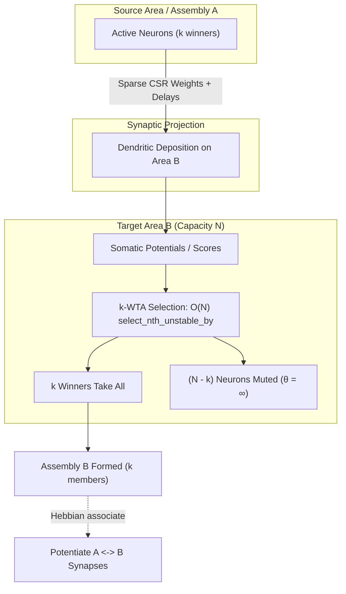
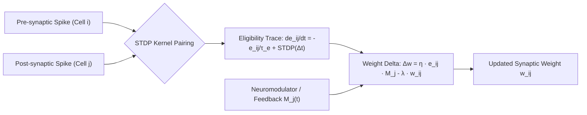
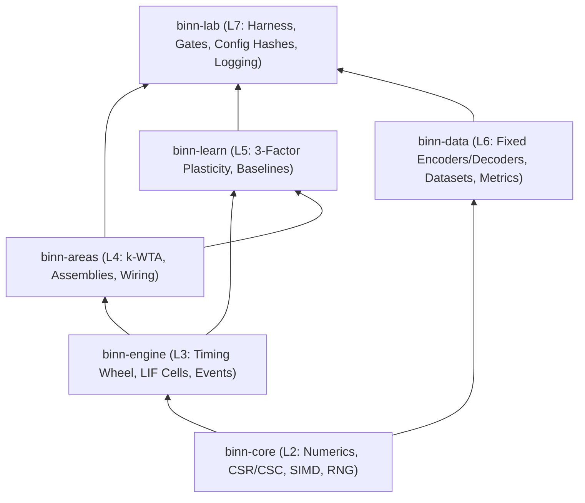

# BINN

<p align="left">
  <a href="https://binn.vbcr.dev/"></a>
  
  
</p>

**Brain-Inspired Neural Network Substrate** — a from-scratch Rust research instrument and simulation engine for testing one falsifiable question:

> Can a sparse-assembly, locally learned, event-driven network learn competitively **without backpropagation**?

<p>
  <a href="https://binn.vbcr.dev/"><strong>Explore the Live Interactive Simulation Showcase (binn.vbcr.dev) &rarr;</strong></a>
</p>

BINN is not a product or neuromorphic deployment framework. It is an exact, deterministic software instrument built with preregistered kill-gates to isolate the computational capabilities and limits of biological learning primitives.

---

## 1. System Architecture

BINN organizes biological principles into a tightly coupled hierarchy spanning from single-compartment dynamics up to multi-area network assemblies and experiment harnesses:



---

## 2. Core Architectural Components

### A. Multi-Compartment Dendritic LIF Neuron (`binn-engine::Cell`)

Each neuron consists of an adaptive somatic compartment $v(t)$, an adaptive somatic threshold $\theta(t)$, and $K=4$ independent dendritic branches $v_{\text{dend}}[i](t)$:



#### Differential Equations:
$$\tau_d \frac{d v_{\text{dend}}[i]}{dt} = -v_{\text{dend}}[i] + I[i]$$
$$\tau_m \frac{dv}{dt} = -v + \sum_{i=1}^K g_c \left( v_{\text{dend}}[i] - v \right)$$
$$\tau_\theta \frac{d\theta}{dt} = -(\theta - \theta_{\text{rest}})$$

- **Analytical Lazy Evaluation:** Sub-threshold dynamics are evaluated analytically when an event touches the cell ($O(1)$ per event), incurring zero compute overhead for silent neurons.
- **Impulse Deposition:** Synapses deposit charge directly into target dendritic branches; supralinear dendritic coincidence is supported via $\sum \max(0, v_{\text{dend}}[i])^2$.
- **Spike Reset:** Somatic spikes reset only the soma ($v \leftarrow 0.0, \theta \leftarrow \theta + \Delta\theta$), preserving dendritic branch potentials across emission.

---

### B. Areas, Assemblies & $k$-WTA Lateral Inhibition (`binn-areas`)

Neurons are partitioned into contiguous populations called **Areas**. An Area restricts maximum concurrent firing to $k$ neurons through lateral inhibition, enforcing strict activity sparsity ($\approx k/N$):



- **Hard $k$-WTA:** Fast $O(N)$ partial selection partitioning top-$k$ scores with deterministic tie-breaking (highest potential $\to$ lowest `CellId`).
- **Soft / Annealed $k$-WTA:** Probabilistic winner selection via $\text{softmax}(s_i / T)$ for temperature-annealed training.
- **Assembly Calculus:** High-level graph operations `project(src, dst)` and `associate(a, b)` model compositional neural assemblies.

---

### C. Online Three-Factor Local Plasticity (`binn-learn`)

Synaptic updates require zero backpropagation through time (BPTT), maintaining **$O(1)$ resident memory in sequence length**:

$$\Delta w_{ij} = \eta \cdot e_{ij}(t) \cdot M_j(t) - \lambda \cdot w_{ij}$$



- **Eligibility Traces ($e_{ij}$):** Synaptic pre/post coincidence triggers exponential decay eligibility traces without global coordination. Reverse CSC indexes enable $O(\text{fan-in})$ postsynaptic lookups.
- **Third Factor ($M_j$):** Global scalar reward, vector Direct Feedback Alignment (DFA), or REINFORCE feedback signals.
- **Selective Weight Decay:** Applied only to synapses with active eligibility ($|e_{ij}| > 10^{-8}$) to avoid baseline weight erosion during quiescence.

---

### D. Event-Driven Simulation & Timing Wheel (`binn-engine::TimingWheel`)

```mermaid
flowchart TD
    subgraph TimingWheelStructure["Hierarchical 8-Level Timing Wheel"]
        L0["Level 0: 256 Ticks (1 Tick/Slot)"]
        L1["Level 1: 65,536 Ticks (256 Ticks/Slot)"]
        L7["... Level 7: Full u64 Time Horizon"]
    end

    Bitmask["Occupancy Bitmask (32 x u64 words)"] -->|trailing_zeros acceleration| L0
    Insert["Schedule Event at Tick t"] -->|O(1) Hash Insert| TimingWheelStructure
    Pop["Pop Earliest Event Batch"] <---|O(1) Cascade| L0
    Pop --> BatchExecute["Execute Spikes at Current Tick"]
```

- **Bitmask Acceleration:** 32-word `u64` bitmask eliminates pointer-chasing scans over empty bucket deques.
- **Activity $\propto$ Compute:** Idle cells incur zero processing time; total work scales with active spike events.

---

## 3. The Research Bet & What Happened

### The Core Hypothesis
The central thesis was that compartmental LIF cells, sparse $k$-WTA assemblies, and online three-factor plasticity could match gradient-based learning on temporal sequence benchmarks without backward unrolls.

### What the Experiments Found
1. **Broadcast $\pm 1$ Three-Factor Insufficiency (Lead Negative — Gate G2 / C1):**
   - On an identical dense-LIF forward pass, broadcast $\pm 1$ scalar reward fails to guide credit assignment, remaining at chance accuracy (**0.5000** feed-forward, **0.5100** recurrent; gap LCB **0.0000** and **−0.0192**; `c1-match-6f6000f148f7d30c`, **FAIL** on both graphs, $n=20$).
   - In contrast, graded feedback alignment (**Matched DFA: 0.9925**) and per-neuron feedback (**Matched RL: 0.9950**) pass the gate. Spatial addressability or gradient-aligned signals are strictly required.
   - These are the **post-repair** figures. The 2026-07 record reported 0.9387 and 0.9200 for the same two arms on a forward pass that emitted **zero spikes at every seed**; the repair and the 20-seed rerun that replaced them are in [`RESULT_2026-08-25_MATCHED_ARCH_RERUN.md`](results/RESULT_2026-08-25_MATCHED_ARCH_RERUN.md), which also **retired the four config hashes** those numbers were published under. The lead negative is the one arm that survived the repair unchanged.
2. **Live $k$-WTA Transfer Barrier:**
   - Transferring successful continuous credit rules to event-driven $k$-WTA architectures encounters severe performance drops due to hard competition boundaries and muted thresholds (v13–v24).
3. **Temporal Attention Readout on LIF (SHD Breakthrough):**
   - Adding a causal self-attention readout layer over feedforward LIF spiking features achieves **0.8320** accuracy on Spiking Heidelberg Digits (**12/12 seeds $\ge 0.80$**, gain **+0.1258** over rate readout).
   - **Wave 9 proved temporal order is the mechanism**: bin-shuffling causes a **+0.1337 accuracy collapse** (96% of the attention advantage is lost without temporal spike order).

---

## 4. Workspace Architecture

Strict upward crate dependency: `lab → data → learn → areas → engine → core`.



| Crate | Layer | Purpose |
|---|---|---|
| [`binn-core`](binn-core/) | L2 | Numeric foundation: SoA buffers, CSR/CSC sparse graphs, ChaCha12 RNG, SIMD vectorization, associative scans |
| [`binn-engine`](binn-engine/) | L3 | Event-driven simulation engine: 8-level timing wheel, multi-compartment LIF cells, synapse tables |
| [`binn-areas`](binn-areas/) | L4 | Cortical populations: $k$-WTA competition, Assembly Calculus (`project`, `associate`), wiring priors |
| [`binn-learn`](binn-learn/) | L5 | Online 3-factor plasticity ($\Delta w = \eta e M - \lambda w$), STDP eligibility, DFA/e-prop/BPTT reference baselines |
| [`binn-data`](binn-data/) | L6 | Fixed rate/latency/population encoders/decoders, SHD dataset framing, disjoint work accounting metrics |
| [`binn-lab`](binn-lab/) | L7 | Experiment runners, multi-seed statistical harnesses, config hashes, verification gates |

---

## 5. Status & Gate Verification

| Gate | Result | Metric / Hash | Scientific Verdict |
|---|---|---|---|
| **G2 (C1 Crux)** | **FAIL** | `c1-118207fbc3eaba53` | Local 3-factor / assembly learning stayed near chance; matched gradient reference passed |
| **Matched DFA** | **PASS** | `c1-dfa-f79c01ea36fe27d7` | Accuracy **0.9925**, Gap LCB **0.9689** (disclose broadcast-graded **0.9975**) |
| **Matched RL** | **PASS** | `c1-rl-d35e13c758e522f8` | Accuracy **0.9950**, Gap LCB **0.9765** (REINFORCE × frozen $B_i$) |
| **G3 (C2 Continual)** | **FAIL** | Local forgetting 0.8948 vs replay baseline 0.2725 | Plasticity alone does not prevent catastrophic forgetting without replay |
| **G4 (R2 Scaling)** | **NO-GO** | Degrading curve (slope −0.1924 vs ln(#areas)) | Area composition does not compound accuracy without hierarchy |
| **SHD Attention Readout** | **0.8320 (12/12 $\ge$ 0.80)** | Waves 1–28, $n=12$ at the anchor, 0 voided | Headline **0.8320** (+0.1258 over rate readout; **0.8332**/+0.1275 at $n=32$). Mechanism is **temporal order** (+0.1337 shuffle drop at $n=12$, **+0.1347 in 32/32**), and it **runs through position** (−0.0752), **has a timescale** ($\tau_{1/2}$ = **261 ms**) and **does not run through spike counts** |

---

## 6. Quick Start

```bash
cd binn

# 1. Build, run unit & integration tests, check global constraints (GC1-GC7)
cargo test --locked --workspace
cargo fmt --all -- --check
cargo clippy --locked --workspace --all-targets -- -D warnings
./scripts/gc_checks.sh

# 2. Run C1 / Gate G2 Quick Pilot (diagnostic only)
cargo run --locked --release -p binn-lab --bin c1 -- --quick

# 3. Replay exact scientific hashes
# Matched broadcast ±1 (FAIL):
cargo run --locked --release -p binn-lab --bin c1 -- --matched-arch \
  --config-hash c1-match-6f6000f148f7d30c

# Matched DFA (PASS):
cargo run --locked --release -p binn-lab --bin c1 -- --matched-dfa \
  --config-hash c1-dfa-f79c01ea36fe27d7

# Matched RL (PASS):
cargo run --locked --release -p binn-lab --bin c1 -- --matched-rl \
  --config-hash c1-rl-d35e13c758e522f8

# Canonical C1 / Gate G2 Replay:
cargo run --locked --release -p binn-lab --bin c1 -- \
  --config-hash c1-118207fbc3eaba53 --out results/c1_g2_replay.md
```

---

## 7. Experiment Inventory & Overrides

| Binary | Gate | Status | Description |
|---|---|---|---|
| `c1` | G2 | Default | Primary crux: local assembly learning vs matched gradient/DFA/RL references |
| `credit-assignment` | — | Default | Exact-forward matched/RPE/e-prop/DFA repreregistration sweep |
| `c2` | G3 | Opt-in | Class-incremental learning and catastrophic forgetting |
| `c3` | — | Opt-in | Multi-layer credit assignment depth analysis |
| `c3-production` | — | Opt-in | Production-engine C3 v2 depth sweep |
| `r1` | — | Opt-in | Multi-area composition sweep |
| `r2` | G4 | Opt-in | Scaling curve vs area count |
| `extensions` | — | Opt-in | U21 consolidation, U22 pruning, U23 resting-state diagnostics |
| `efficiency` | G5 | Opt-in | Activity-vs-compute accounting & reset barrier headroom |

### Post-G2 Overrides (Explicit Flags Required)
G2 FAIL is permanent. Running downstream experiments requires explicit opt-in flags:
```bash
cargo run --release -p binn-lab --bin c2 -- --enable-c2 --out results/c2_g3.md
cargo run --release -p binn-lab --bin c3 -- --enable-c3 --out results/c3_credit_depth.md
cargo run --release -p binn-lab --bin r1 -- --enable-r1 --out results/r1_composition.md
cargo run --release -p binn-lab --bin r2 -- --enable-r2 --out results/r2_scaling.md
```

---

## 8. Offline Viewer & Figures

```bash
# Export trace from C1 run to JSONL
cargo run -p binn-lab --bin c1 -- --quick --export-trace results/c1_trace.jsonl

# Open the self-contained interactive viewer in your browser
open results/viewer.html

# Render vector paper figures (uses pure Rust plotters, no Python/matplotlib)
cargo run --locked --release -p binn-lab --features plots --bin paper-figures -- \
  --out results/runs/2026-07-23-paper-hard-both/figures
```

---

## 9. Global Architectural Constraints (CI Enforced)

All code adheres to strict global constraints verified by `.github/workflows/ci.yml` and `scripts/gc_checks.sh`:

| ID | Constraint | Enforcement |
|---|---|---|
| **GC1** | **No Autograd on Production Path** | Zero backpropagation graphs or dense matmuls in `binn-engine`, `binn-areas`, or `binn-learn` production paths. |
| **GC2** | **Zero External ML Frameworks** | No `torch`, `candle`, or `tensorflow` dependencies. |
| **GC3** | **Bit Determinism** | Bit-identical results for identical PRNG seeds across identical platforms. |
| **GC4** | **Fixed Input Encoders** | Encoders are fixed functions; zero learned autodiff front-ends. |
| **GC5** | **Benchmark Coverage** | All hot simulation paths have compiling Criterion benchmarks. |
| **GC6** | **Zero Undocumented Unsafe** | `#![deny(unsafe_code)]` or mandatory architectural justification. |
| **GC7** | **Activity Sparsity Logging** | Firing activity ratio ($\le k/N$) must be logged for every run. |

---

## 10. Documentation Index

Root holds five documents; everything else lives under `results/`,
`hybrid-results/`, or `docs/archive/`.

**Root**

- [`BINN_Agent_Build_Spec_v8.md`](BINN_Agent_Build_Spec_v8.md) — the specification; the only one the code cites
- [`BINN_HYBRID_PROTOCOL.md`](BINN_HYBRID_PROTOCOL.md) — the successor line (H0 `HYBRID_NO_GO`); its evidence is under `hybrid-results/`, never `results/`
- [`CLAUDE.md`](CLAUDE.md) / `AGENTS.md` — agent workspace guide (one file, two names)

**Record** — [`results/INDEX.md`](results/INDEX.md) is generated by `scripts/build_results_index.py` and is the entry point. Read a retired document only through the document that retired it; the index says which.

- [`results/PAPER_DRAFT.md`](results/PAPER_DRAFT.md) — paper prose draft
- [`results/PAPER_GAPS_2026-08-29.md`](results/PAPER_GAPS_2026-08-29.md) — what stands between the package and submission
- [`results/TODO_2026-08-07_OPEN_WORK.md`](results/TODO_2026-08-07_OPEN_WORK.md) — open work, by blocking order; §9 holds external reading and candidate experiments
- [`results/SUMMARY_2026-08-22_CAMPAIGN_AND_RECORD_REPAIR.md`](results/SUMMARY_2026-08-22_CAMPAIGN_AND_RECORD_REPAIR.md) — the 2026-08-19→22 record: 720 cells across ten waves, four withdrawn results
- [`results/PUBLISHABLE_CLAIMS.md`](results/PUBLISHABLE_CLAIMS.md), [`results/PAPER_RESULTS_TABLE.md`](results/PAPER_RESULTS_TABLE.md) — claim ladder and results table; both **retired in part** by the 2026-08-25 matched-architecture re-run, read their banners first

**Archive** — [`docs/archive/genesis/`](docs/archive/genesis/README.md): the v1–v7 planning lineage that produced Spec v8, and two chatbot literature reviews. Not evidence; do not cite.

---

## License

Dual-licensed under MIT or Apache-2.0.
