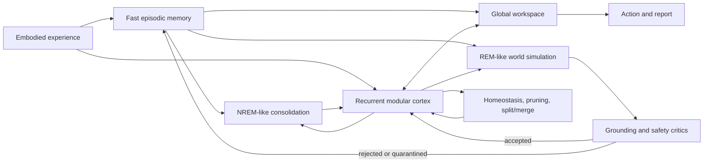

# Artificial Neural Networks and the Human Brain

## Convergence, Divergence, and a Next-Generation Architecture

**Literature reviewed through:** July 22, 2026  
**Focal paper:** Ali Behrouz, Farnoosh Hashemi, Adel Javanmard, and Vahab Mirrokni, *Language Models Need Sleep: Learning to Self-Modify and Consolidate Memories*, arXiv:2606.03979v2.

## Scope and central judgment

This review treats Behrouz et al.'s *Language Models Need Sleep* as the focal paper and evaluates it against experimental neuroscience, continual learning, modular architectures, and machine "dreaming." The paper is currently an arXiv preprint—version 2 dated July 10, 2026—so its findings should be considered promising but not independently established. [Behrouz et al., 2026](https://arxiv.org/html/2606.03979v2)

The strongest conclusion is:

> Modern ANNs increasingly reproduce useful computational principles of brains—distributed representation, sparse routing, complementary memory timescales, replay, consolidation, and internal simulation—but they do not reproduce the underlying biological mechanisms or justify claims about consciousness, subconscious cognition, or dreaming.

"Sleep," "dreaming," "synaptic pruning," and "experts" are therefore best understood as functional metaphors unless a model also implements the relevant timing, local plasticity, recurrent circuitry, neuromodulation, homeostasis, and causal behavioral signatures.

## Executive comparison

| Dimension | Biological brain | Current ANN analogue | Fidelity |
|---|---|---|---|
| Learning | Local synaptic plasticity, dendritic integration, eligibility traces, neuromodulators, and metaplasticity | Backpropagation from a global scalar objective | Low mechanistic, high optimization utility |
| Episodic memory | Rapid, pattern-separated hippocampal encoding | Context windows, external memory, and replay buffers | Partial computational analogy |
| Consolidation | Selective hippocampo-cortical reactivation coordinated by ripples, spindles, and slow oscillations | Rehearsal, distillation, generative replay, and offline fine-tuning | Moderate functional analogy |
| Forgetting | Interference, retrieval suppression, synaptic weakening, remodeling, and neurogenesis | Catastrophic overwriting, pruning, weight decay, and machine unlearning | Different causes and selectivity |
| Modularity | Overlapping, recurrent, multiscale networks with connector hubs | MoE top-*k* routing and modular neural networks | Moderate but oversimplified |
| Dreaming | Endogenous phenomenology across sleep stages; memory incorporation is selective and transformed | Synthetic samples and latent world-model rollouts | Functional metaphor only |
| Resting-state cognition | Persistent intrinsic activity involving DMN, salience, attention, and control systems | Background reflection, self-play, planning, and sleep-time compute | Currently weak |
| Subconscious processing | Processing that influences behavior without reportable awareness | Hidden activations or unexposed intermediate computation | Not equivalent |
| Energy and adaptation | Event-driven, recurrent, continually plastic, and embodied | Clocked accelerators, minibatches, and mostly static deployment | Major divergence |

## 1. Biological versus artificial mechanisms

### 1.1 Synaptic plasticity versus backpropagation

Biological plasticity is heterogeneous. Depending on brain region and state, it includes Hebbian and anti-Hebbian changes, spike-timing-dependent plasticity, synaptic tagging, heterosynaptic plasticity, homeostatic scaling, dendritic plateau events, and neuromodulator-gated eligibility traces. A synapse generally has access to local pre- and postsynaptic activity plus slower modulatory signals—not an exact derivative of a distant task loss.

Standard backpropagation instead requires:

- A differentiable global objective.
- Separate forward and backward computations.
- Stored activations or equivalent recomputation.
- Precisely coordinated credit assignment across layers.
- In its conventional form, weights or equivalent derivatives transported through the backward pathway.

Feedback alignment shows that exact symmetric weights are not always necessary, while newer models use dendrites, predictive errors, equilibrium dynamics, or noise-mediated feedback learning. Nevertheless, these remain candidate computational accounts, not a settled biological explanation. [Lillicrap et al., 2016](https://www.nature.com/articles/ncomms13276), [Max et al., 2024](https://www.nature.com/articles/s42256-024-00845-3)

Recent dendritic ANNs also demonstrate that incorporating compartmental structure and restricted connectivity can improve robustness and parameter efficiency. That is an engineering benefit of neurobiological inspiration, not evidence that the brain is running a conventional deep-learning objective. [Chavlis and Poirazi, 2025](https://www.nature.com/articles/s41467-025-56297-9)

**Assessment:** Backpropagation may approximate useful credit-assignment outcomes, but its mechanism diverges sharply from biological plasticity. A biologically credible successor would combine local eligibility traces, separate modulatory signals for reward, novelty, and uncertainty, dendritic error compartments, and slower metaplastic control.

### 1.2 Hippocampal replay versus experience replay

The complementary learning systems theory proposes a fast hippocampal system for episodes and a slower neocortical system for extracting statistical structure. Interleaved reinstatement lets the cortex learn new regularities without overwriting older ones. [McClelland, McNaughton, and O'Reilly, 1995](https://pubmed.ncbi.nlm.nih.gov/7624455/)

Experimentally, replay is not a literal recording played back from a buffer:

- It occurs during NREM sleep and quiet wakefulness.
- It may be temporally compressed, reordered, forward, or reverse.
- It is selected by novelty, salience, reward, and prior knowledge.
- Hippocampal ripples interact with cortical slow oscillations and thalamocortical spindles.
- Cortical activity can influence what the hippocampus subsequently replays.

Simultaneous recordings have found coordinated replay across hippocampus and neocortex, while causal disruption of particular ripple substates impairs recent memory. [Ji and Wilson, 2007](https://www.nature.com/articles/nn1825), [Rothschild, Eban, and Frank, 2017](https://www.nature.com/articles/nn.4457), [Chang et al., 2025](https://www.nature.com/articles/s41586-024-08340-w)

Artificial experience replay is simpler. A buffer stores examples or transitions and resamples them to reduce correlation, stabilize gradients, or preserve older tasks. Generative replay replaces stored observations with samples from a learned generator. It is effective, but the generator can drift, omit rare cases, or recursively amplify its own errors. [Shin et al., 2017](https://arxiv.org/abs/1705.08690), [van de Ven et al., 2020](https://www.nature.com/articles/s41467-020-17866-2)

Sleep-like ANN replay using noisy spontaneous activity and local Hebbian rules has recovered apparently forgotten representations in experimental networks. This is biologically closer than ordinary buffer sampling, although still far simpler than real sleep. [Tadros et al., 2022](https://www.nature.com/articles/s41467-022-34938-7)

**Assessment:** The best convergence lies at the algorithmic level: fast storage plus slower interleaved learning. The divergence lies in replay generation, oscillatory coordination, selection, causal circuitry, and plasticity rules.

### 1.3 Catastrophic forgetting versus active forgetting

Catastrophic forgetting occurs when gradient updates for a new distribution move shared parameters away from solutions needed for previous distributions. Current responses include:

- Rehearsal or generative replay.
- Weight regularization, such as elastic weight consolidation.
- Gradient constraints.
- Parameter isolation.
- Progressive networks and architectural expansion.
- Sparse routing and adapters.

EWC protects parameters estimated to be important for previous tasks, but it usually assumes recognizable task transitions and only approximates functional importance. [Kirkpatrick et al., 2017](https://doi.org/10.1073/pnas.1611835114)

Biological forgetting is not simply the same failure at smaller scale. Humans exhibit interference and memory distortion, but forgetting can also be adaptive:

- Retrieval may be transiently suppressed without destroying the memory.
- Weak or irrelevant synapses may be depressed.
- Circuit remodeling can reduce access to older hippocampal traces.
- Gist may be preserved while episode-specific detail is lost.
- New learning can be facilitated by removing obsolete associations.

For example, dopamine can transiently suppress retrieval in *Drosophila* without erasing the long-term trace. [Sabandal, Berry, and Davis, 2021](https://www.nature.com/articles/s41586-020-03154-y)

Likewise, synaptic pruning is not synonymous with deleting memories. REM sleep can eliminate some newly formed dendritic spines while strengthening and preserving others. [Li et al., 2017](https://www.nature.com/articles/nn.4479)

**Assessment:** Catastrophic forgetting is mostly uncontrolled interference. Biological forgetting is often selective, state-dependent, and functionally regulated. Next-generation systems need *adaptive forgetting*: reversible retrieval suppression, confidence-aware decay, provenance-based deletion, and consolidation of gist before episodic details are discarded.

## 2. Evaluation of *Language Models Need Sleep*

### Core proposal

Behrouz et al. replace the static train/test distinction with alternating wake and sleep phases:

1. **Wake:** Fast modules absorb contextual information.
2. **Memory consolidation:** Knowledge is transferred toward slower-updating modules using "knowledge seeding"—upward self-distillation into newly activated low-rank experts.
3. **Dreaming:** The model generates synthetic training examples, scores their expected utility, injects novelty through random MoE routing, and uses RL to select self-improving updates.
4. **Reset/pruning:** Previously used fast low-rank parameters are reset after their information is consolidated.

This is a substantial advance over merely retaining a longer context. It treats continual learning as a hierarchy of update timescales and combines architectural growth, parameter isolation, distillation, and generative rehearsal.

### Reported evidence

Among the paper's point estimates:

- Qwen3-8B "Sleep" scores 79.2/69.0/46.1 on AIME-24/AIME-25/HMMT-25, compared with 73.8/68.1/42.4 for the base model.
- Four-level Sleep reaches 48.9 and 46.2 in the two SQuAD knowledge-incorporation settings, versus 46.7 and 43.2 for SEAL.
- Few-shot ARC reaches 80%, versus 72.5% for SEAL.
- The Hope architecture reportedly retains BABILong performance to 10 million tokens after task-specific fine-tuning.
- Ablations indicate positive contributions from imitation learning, expansion, gradient-based dream selection, and random expert routing. [Results and ablations](https://arxiv.org/html/2606.03979v2#S4)

### Scientific strengths

- It explicitly separates fast adaptation from slower consolidation.
- It combines parameter protection with capacity allocation rather than assuming all new knowledge must fit into a fixed representation.
- It recognizes that replay should transform and abstract experience rather than merely reproduce raw samples.
- It includes recent and old knowledge in a staged continual-learning account.
- It directly addresses failures of iterated self-distillation and fixed-capacity adaptation.

### Important limitations

1. **"Sleep" remains backpropagation-based offline training.**  
   There are no sleep oscillations, local biological plasticity, autonomic state transitions, or hippocampo-cortical circuits.

2. **The "dreams" are optimized synthetic examples.**  
   They are generated and selected using downstream gradients and RL rewards. This is closer to curriculum learning or self-training than biological dreaming.

3. **Parameter growth is partly preallocation.**  
   The implementation can reserve parameters and mask them until activation. That provides conditional capacity, but it is not structural neurogenesis.

4. **"Synaptic pruning" is an overstretched analogy.**  
   Resetting a LoRA expert after distillation is deterministic parameter reuse; biological pruning is activity-, development-, cell-, and circuit-dependent and can coexist with selective stabilization.

5. **Small or filtered evaluations limit generality.**  
   The ARC experiment uses 11 training and eight held-out tasks and evaluates five dream-induced adaptations per task. Those outcomes are correlated, so the nominal sample count should not be treated as many independent tasks.

6. **Uncertainty is underreported.**  
   The primary tables emphasize point estimates; stronger evidence would require seed-level variance, confidence intervals, paired tests, and sensitivity to sleep schedules.

7. **Compute comparisons require matched accounting.**  
   The authors report ordinary SFT as approximately four times faster per equal training steps, while claiming Sleep becomes faster when methods are trained to a target score. End-to-end accounting should include dream generation, reward evaluation, rejected samples, distillation, and inference-time adaptation.

8. **No open-ended lifelong deployment has been demonstrated.**  
   Benchmark task streams do not establish stable adaptation over months, adversarial updates, contradictory knowledge, distribution drift, or bounded memory budgets.

9. **Self-generated data create epistemic risk.**  
   A model may consolidate hallucinations, biases, reward-model errors, or overly confident reasoning unless dreams are grounded by external evidence or independent critics.

**Verdict:** The paper is an important continual-learning architecture and one of the clearest current demonstrations of multi-timescale LLM consolidation. It is not yet a biological model of sleep.

## 3. Architectural specialization

### Brain modularity and cortical columns

Human brain organization combines segregation and integration. Sensory, motor, language, memory, attention, salience, and default networks have recognizable specialization, but their boundaries overlap and reconfigure with task and state. Connector hubs coordinate information across modules.

Columnar organization is well established in some sensory systems; cellular-resolution imaging, for example, reveals organized functional microstructure in visual cortex. [Ohki et al., 2005](https://www.nature.com/articles/nature03274) But the stronger assertion that all cortical areas are tiled by identical "canonical columns" implementing the same operation remains disputed. [Horton and Adams, 2005](https://pubmed.ncbi.nlm.nih.gov/15937015/)

Thus the brain is not well described as a bank of isolated experts. It has:

- Dense recurrence within and between modules.
- Overlapping membership.
- Multiple spatial and temporal scales.
- Developmental specialization.
- Neuromodulatory state control.
- Degeneracy: structurally different circuits can perform similar functions.
- Pluripotentiality: the same circuit can serve different functions by context.

### Mixture of Experts and modular ANNs

Sparse MoE models route each token to a small subset of feed-forward experts, increasing parameter capacity without proportional active computation. Switch Transformers demonstrated the engineering value of this design, while also exposing routing instability, load imbalance, and communication overhead. [Fedus, Zoph, and Shazeer, 2021](https://arxiv.org/abs/2101.03961)

Recurrent Independent Mechanisms are closer to functional brain modularity: recurrent submodules update selectively and communicate through attention bottlenecks, improving systematic generalization when environmental mechanisms change independently. [Goyal et al., 2020](https://openreview.net/forum?id=BylaUTNtPS)

Nevertheless:

- A top-*k* router is not biological attention.
- Experts often specialize because of optimization and data partitioning, not because they correspond to cognitive faculties.
- Expert identity may be unstable across training.
- Structural sparsity does not guarantee functional specialization.
- MoE routing is usually feed-forward and instantaneous, whereas brain recruitment is recurrent, competitive, cooperative, and history-dependent.

The focal Sleep paper's random selection of an additional expert during dreaming is an interesting mechanism for cross-module recombination. But biological REM novelty is unlikely to be equivalent to randomly mixing unrelated feed-forward blocks.

## 4. Subconscious processing, dreaming, and resting-state networks

### Subconscious processing

Neuroscience uses operational distinctions: a stimulus may affect priming, decisions, or neural activity without being consciously reported. Masked words, for example, can activate perceptual and motor-associated regions and influence later processing. [Dehaene et al., 2001](https://www.nature.com/articles/nn0701_752)

Calling ANN hidden activations "subconscious" is misleading because:

- Most networks have no mechanism for reportability or awareness.
- An inaccessible hidden vector is inaccessible to the user, not necessarily to the network.
- There is no demonstrated subjective state.
- The distinction between globally broadcast and locally processed information must be architected and experimentally tested.

A defensible functional analogue would separate local specialist computation from a limited-capacity global workspace used for reporting, planning, and action. Only information that enters the workspace would become globally accessible; local processes could still bias routing or action without broadcast.

### Dream-like consolidation

Machine "dreaming" has at least three meanings:

1. **Wake-sleep learning:** Alternating recognition and generative phases in Helmholtz machines. [Hinton et al., 1995](https://www.cs.toronto.edu/~hinton/absps/ws.htm)
2. **Generative replay:** Sampling approximate old experiences to prevent forgetting.
3. **World-model imagination:** Simulating latent futures to train policies, exemplified by DreamerV3. [Hafner et al., 2025](https://www.nature.com/articles/s41586-025-08744-2)

All are productive analogies, but none entails dreaming as experience.

Moreover, the traditional equation "NREM = replay, REM = creative recombination" is too clean. Both stages contribute to memory processing, and their roles depend on task, oscillatory timing, and sleep microstructure. A 2026 experiment found that REM altered semantic associations but did not, by itself, reliably improve problem-solving success. [Bieth et al., 2026](https://www.nature.com/articles/s42003-026-10354-1)

### Default Mode Network

The DMN was identified as a reproducible high-baseline network that decreases during many externally directed tasks. It includes medial prefrontal, posterior cingulate/precuneus, lateral parietal, and medial temporal components. [Raichle et al., 2001](https://pubmed.ncbi.nlm.nih.gov/11209064/)

Its functions include aspects of:

- Autobiographical memory.
- Self-referential processing.
- Scene construction and future simulation.
- Social inference.
- Spontaneous thought.
- Integration of internal knowledge with current goals.

But three corrections are essential:

1. **DMN is not a "sleep network."**
2. **Rest is not inactivity.**
3. **DMN does not operate alone:** internally generated thought depends on interactions with hippocampal, salience, frontoparietal-control, and sensory systems.

Current LLMs have no close DMN counterpart. They usually cease computation between prompts, retain no ongoing endogenous state, and lack an autobiographical self-model tied to embodied needs. Agentic reflection loops and sleep-time compute are closer functionally, but normally run only because an external scheduler invokes them.

## 5. Fundamental limitations of current ANNs as models of biological intelligence

The deepest gaps are not parameter count or benchmark performance:

- **Credit assignment:** Global gradients versus local, state-dependent plasticity.
- **Temporal organization:** Discrete training runs versus nested timescales from milliseconds to years.
- **Continual autonomy:** Externally scheduled retraining versus intrinsic regulation of learning, rest, and consolidation.
- **Memory architecture:** Context and weights versus episodic, semantic, procedural, working, emotional, and prospective systems.
- **Recurrence:** Largely feed-forward token processing versus continuously recurrent sensorimotor dynamics.
- **Embodiment:** Text/image distributions versus action-conditioned, metabolically constrained interaction.
- **Motivation:** Externally supplied objectives versus interacting homeostatic, social, affective, and exploratory drives.
- **Causal grounding:** Statistical association versus interventions with persistent consequences.
- **Development:** Training from a largely fixed architecture versus growth, critical periods, pruning, and culturally scaffolded learning.
- **Structural plasticity:** Modifying numerical weights versus forming, eliminating, and repurposing connections.
- **Self-generated data safety:** Model-generated errors can become future "memories."
- **Consciousness:** Behavioral fluency provides no evidence of phenomenology.

Accordingly, reproducing human-level outputs does not demonstrate convergence at the mechanistic or experiential levels.

## 6. Proposed next-generation framework: MOSAIC-Sleep

I propose a **Multiscale Offline-Online System for Adaptive Integration and Consolidation**. It combines the strongest elements of complementary learning systems, modular recurrence, local plasticity, world models, and the focal paper's multi-frequency consolidation.

### Required components

1. **Fast episodic store**  
   Pattern-separated, timestamped memories with provenance, uncertainty, salience, and causal consequences—not just raw interaction logs.

2. **Slow recurrent semantic cortex**  
   Sparse modules with overlapping routing, lateral recurrence, and different learning timescales. Experts may split, merge, or become dormant based on measured interference.

3. **Local plasticity plus global modulation**  
   Synapses maintain eligibility traces; broadcast signals encode reward, novelty, uncertainty, surprise, and safety. Backpropagation can remain as a scaffold during research but should gradually be replaced by locally available objectives.

4. **NREM-like phase**  
   Interleave recent, remote, rare, contradictory, and high-value experiences. Distill episodic detail into semantic structure; calibrate uncertainty; renormalize excessive weights; and test whether old capabilities remain causally accessible.

5. **REM-like phase**  
   Generate counterfactual and prospective rollouts through a learned world model. Encourage cross-module recombination, but prevent direct consolidation until independent critics verify consistency, novelty, utility, and safety.

6. **Adaptive forgetting**  
   Separate retrieval suppression from erasure. Preserve compressed gist and provenance before detailed traces decay. High-risk deletion should be reversible through quarantine or archived episodic memory.

7. **DMN-like resting controller**  
   During input-poor periods, maintain goals, inspect unresolved prediction errors, retrieve unfinished episodes, simulate futures, and update an autobiographical temporal graph. This would be a functional resting-state analogue—not a claim of consciousness.

8. **Plasticity budgets and structural homeostasis**  
   Allocate new experts only when interference, uncertainty, or capacity metrics cross thresholds. Penalize unbounded architectural growth, router collapse, and redundant memories.

### Falsifiable evaluation program

A serious brain-inspired system should be tested on:

- Months-long nonstationary streams without explicit task IDs.
- Contradictory updates and later corrections.
- Rare-event retention.
- Recent-versus-remote replay ablations.
- Compute-, parameter-, and data-matched controls.
- Calibration and provenance after self-generated training.
- Recovery after false-memory injection.
- Selective forgetting without collateral loss.
- Energy per retained capability.
- OOD transfer from REM-like recombination.
- Causal module lesions and replay disruption.

The crucial predicted dissociation is that NREM-like replay should primarily improve retention and calibration, whereas REM-like simulation should primarily improve transfer and counterfactual planning—but should also produce more confabulation when grounding critics are removed.

## Conclusion

ANNs and brains are converging in **computational motifs**, not in biological implementation. Replay, sparse specialization, multi-timescale memory, internal simulation, and offline consolidation are likely enduring design principles. But backpropagation is not synaptic plasticity, a replay buffer is not a hippocampus, MoE experts are not cortical columns, synthetic data are not dreams, and background inference is not a Default Mode Network.

*Language Models Need Sleep* is best viewed as a strong engineering hypothesis: capable lifelong systems require alternating periods of externally driven adaptation and internally driven consolidation. Its biological vocabulary is scientifically productive when used to generate testable mechanisms—but becomes misleading if functional analogy is treated as mechanistic equivalence.
