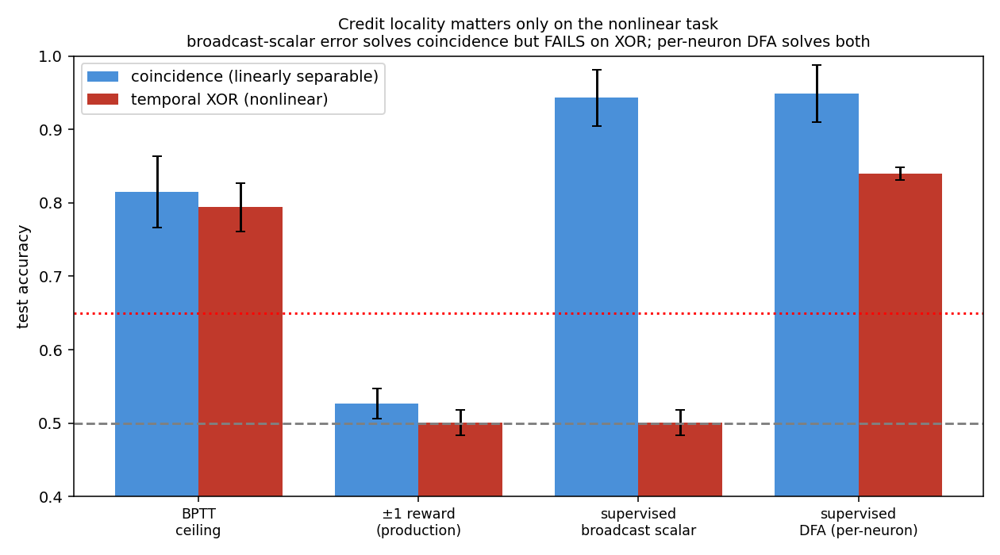

# Matched-Architecture — deep hypotheses (NumPy preview, round 2)

**Date:** 2026-07-23 · **Status:** preview; revises `MATCHED_ARCH_FINDINGS.md`
**Script:** `scripts/matched_arch_deep.py` · **Data:** `results/deep_*.json`
Not a Rust verdict. Does not touch `c1-118207fbc3eaba53`.

---

## Why this round exists

Round 1 concluded "the bottleneck is the reward signal, not credit locality,"
because a broadcast **scalar** supervised error solved the coincidence task. That
conclusion was **task-specific and is now qualified**. Three deeper probes:

## A. What is the ±1 reward missing — direction, gradation, or eligibility?

Ladder on coincidence (n=12), each rule adds one ingredient to the broadcast
reward:

| Rule | mean | reading |
|---|---:|---|
| `rl_flat` (±1 reward, broadcast) — **production** | 0.53 | chance |
| `rl_graded` (graded correctness − baseline, broadcast) | 0.81 | **gradation alone rescues** |
| `rl_reinforce` (reward × (a−p), broadcast) | 0.73 | direction alone helps |
| `rl_reinforce_fb` (× fixed random feedback) | 0.84 | direction + per-neuron helps |
| `err_broadcast` (supervised −(p−y), broadcast) | 0.94 | graded **and** directional = best |
| `err_dfa` (supervised × random feedback) | 0.95 | best |

**Revision of round 1:** it is **not** "direction, not gradation." *Either*
ingredient — grading the reward (`rl_graded` 0.81) *or* signing it with the
exploratory action (`rl_reinforce` 0.73) — substantially rescues the broadcast
reward; having both (a supervised error) is cleanly best. The production ±1 reward
fails because it is an **impoverished scalar** (binary, unsigned), not because
locality is required *on this easy task*.

Actionable consequence: BINN can likely be fixed **in-family** by making the
neuromodulator a **graded critic / RPE with real gradation** — note `rl_graded`
(graded) works while round-1 `rpe` (±1 reward minus a scalar baseline) did not.
The fix is *grade the reward itself*, not *subtract a baseline from a binary one*.

**Rust port update (protocol v11 → v12, same day):** on the matched dense-LIF
harness, v11 primary `rl_graded` **FAIL**s G2 (`c1-rl-ef504db58916720d`: mean
0.5900 / gap LCB 0.0182) while contrast `rl_reinforce_fb` reached 0.9112.
Protocol **v12** preregisters `rl_reinforce_fb` as primary under a fresh hash
(`c1-rl-42eddc9c801308e9`) and **PASS**es G2 (fb **0.9200** / gap LCB
**0.6846**; graded contrast 0.5250; flat 0.5113). See
`MATCHED_ARCH_RL_CONTROL.md`. Gradation alone does **not** transfer from this
NumPy preview; directional REINFORCE × per-neuron feedback does — and clears
the matched RL gate when gated honestly. **Product follow-up (P8):** production
`ReinforceFeedback` + `reinforce_term` now expose that family on the
`ThreeFactor` credit path (default C1 still broadcast ±1) — see
`MATCHED_ARCH_PRODUCT_NEUROMOD.md`.

## B. Can a scalar reward teach the hidden layer by exploration alone?

Node perturbation (perturb hidden activity, correlate with reward change),
coincidence, n=12:

| Rule | mean |
|---|---:|
| `np_reward` (±1 reward change) | 0.54 |
| `np_graded` (graded objective change) | 0.65 |

A scalar ±1 reward barely teaches even via perturbation (0.54); grading helps but
stays noisy (variance scales with #perturbed units). So the reward-impoverishment
result is **mechanism-independent** — it is the signal, not the specific Hebbian
eligibility, that is weak.

## C. Nonlinear task (temporal XOR) — locality suddenly matters

The headline of round 2. Temporal-XOR (label = early_A ⊕ early_B; not linearly
separable). n=12, 1 hidden layer:



| Rule | coincidence | **XOR** |
|---|---:|---:|
| gradient (ceiling) | 0.82 | 0.79 |
| readout_only | 0.50 | 0.50 |
| `rl_flat` (production) | 0.53 | 0.50 |
| **`err_broadcast`** (scalar error) | **0.94** | **0.50 — FAILS** |
| **`err_dfa`** (per-neuron feedback) | **0.95** | **0.84 — solves** |

**The broadcast-scalar error that solved coincidence FAILS on XOR (0.50), while
per-neuron DFA solves both.** So credit **locality is task-dependent**: on a
linearly-separable task a single scalar suffices; on a nonlinear task the hidden
layer must receive **differentiated, per-neuron** credit. This reconciles the
matched-control work with BINN's actual thesis (deep/hard credit assignment, cf.
C3 `D*=3` vs `8`): a broadcast neuromodulator is only sufficient in the easy
regime.

## Unified picture (revised)

Two axes both matter, and their importance is **task-dependent**:

1. **Signal richness** — ±1 reward (fails everywhere) < graded/directional reward <
   supervised error. Grade the modulator and most of the gap closes on easy tasks.
2. **Credit locality** — irrelevant on linearly-separable tasks (broadcast scalar
   works), **decisive on nonlinear tasks** (only per-neuron feedback / DFA works).

For BINN, the concrete recipe that closes the gap **locally and without backprop**
is therefore: a **directional, graded error** delivered through **per-neuron
feedback** (feedback alignment / DFA). A single broadcast neuromodulator — the
production design — is provably insufficient the moment the task is nonlinear.

## D. Depth (2-layer XOR) — NOW ANSWERABLE (P1 fix applied)

**Update (same day):** stronger 2-layer init (`win` scale 1.5, `w12` ~1.8/√h) plus
teaching `w12` under local rules makes the deep forward trainable. Re-run
`--exp depth` (n=12, epochs=90):

| Rule | mean |
|---|---:|
| gradient (ceiling) | **0.83** |
| readout_only (frozen random features) | 0.78 |
| `err_broadcast` | 0.76 |
| `err_dfa` | **0.84** |
| `np_graded` | 0.77 |

BPTT clears the floor; DFA matches the ceiling. Caveat: with this init,
`readout_only` is already high (0.78) — random 2-layer features make XOR partly
linearly separable at the rate readout — so the locality contrast is softer than
on 1-layer XOR. The harness is valid for depth questions; interpret against the
readout-only baseline, not chance alone. Data: `results/deep_depth.json`.

**Superseded for locality claims by §F** (`--exp depth_locality`): compare excess
over `readout_only`, and use mid init when claiming depth help.

## Caveats (unchanged + new)

- NumPy preview; feed-forward; simple tasks; BPTT ceiling is noisy.
- XOR locality flip is now confirmed on a **second** nonlinear cut (`xor_thresh`,
  early = `t < 3` instead of `t < T/2`) — see §E. Boolean dual (XNOR) does *not*
  flip (broadcast also solves) — locality necessity is task-dependent, not
  universal across all nonlinear labels.
- "Supervised error" needs a target at the output (legitimate for classification;
  a departure from pure reward). The reward-side fix (`rl_graded`, `rl_reinforce_fb`)
  is the biologically-faithful analogue to pursue for BINN. **Rust v11/v12:**
  `rl_graded` failed as primary; `rl_reinforce_fb` PASSed as v12 primary
  (`c1-rl-42eddc9c801308e9`).
- Depth is now trainable, but strong-init 2-layer features inflate `readout_only`;
  see §F — do **not** claim C3-style depth locality from P1 strong-init numbers.

## E. P3 — locality flip on a second nonlinear task (`xor_thresh`)

**Update (same day):** temporal XOR with early cut `thresh=3` (not `T/2=4`).
n=12, epochs=90, data `results/deep_xor_thresh.json` (also `deep_xor_thresh3.json`).

| Rule | XOR (thresh=T/2) | **XOR (thresh=3)** |
|---|---:|---:|
| gradient | 0.79 | 0.77 |
| readout_only | 0.50 | 0.50 |
| `err_broadcast` | **0.50 — FAILS** | **0.50 — FAILS** |
| `err_dfa` | **0.84 — solves** | **0.83 — solves** |

Same locality flip. Contrast: temporal XNOR (`results/deep_xnor.json`) has
broadcast **0.83** (also solves) — so the flip is not automatic for every
nonlinear Boolean of early/late features.

## F. Depth locality vs inflated `readout_only` (closed)

**Update (same day):** `--exp depth_locality` adds `rl_reinforce_fb`, `rl_flat`,
`freeze_l1`, paired excess-over-readout stats, and init presets
(`strong`/`mid`/`weak`). Full write-up:
[`MATCHED_ARCH_DEPTH_LOCALITY.md`](MATCHED_ARCH_DEPTH_LOCALITY.md).

| Init | grad | readout | DFA | DFA exLCB | rl_fb | rl_fb exLCB | broadcast |
|---|---:|---:|---:|---:|---:|---:|---:|
| strong (P1) | 0.83 | **0.78** | 0.84 | +0.023 | 0.81 | **−0.016** | 0.76 |
| **mid** | 0.83 | **0.51** | 0.83 | **+0.261** | 0.80 | **+0.236** | 0.82 |
| weak | 0.51 | 0.51 | 0.54 | — | 0.51 | — | 0.51 |

- **Strong:** soft — DFA barely beats readout; `rl_reinforce_fb` does not clear
  excess LCB. Do not claim C3-style depth locality from P1 tables.
- **Mid:** valid harness (grad high, readout ≈ chance). DFA and `rl_reinforce_fb`
  clear large excess, but **broadcast does too** — depth/feature learning helps;
  **locality is not required** (unlike 1-layer XOR). `freeze_l1` ≈ full DFA.
- **Weak:** invalid harness (silent deep path).

Locality evidence remains the 1-layer XOR / `xor_thresh` flip (§C / §E), not 2-layer.

## Reproduce

```bash
python3 -m scripts.matched_arch_deep --exp direction --seeds 12 --epochs 70 --out results/deep_direction.json
python3 -m scripts.matched_arch_deep --exp nodepert  --seeds 12 --epochs 70 --out results/deep_nodepert.json
python3 -m scripts.matched_arch_deep --exp xor       --seeds 12 --epochs 90 --out results/deep_xor.json
python3 -m scripts.matched_arch_deep --exp xor_thresh --seeds 12 --epochs 90 --out results/deep_xor_thresh.json
python3 -m scripts.matched_arch_deep --exp xnor      --seeds 12 --epochs 90 --out results/deep_xnor.json
python3 -m scripts.matched_arch_deep --exp depth     --seeds 12 --epochs 90 --out results/deep_depth.json
python3 -m scripts.matched_arch_deep --exp depth_locality --seeds 12 --epochs 90 \
  --init-preset strong --out results/deep_depth_locality.json
python3 -m scripts.matched_arch_deep --exp depth_locality --seeds 12 --epochs 90 \
  --init-preset mid --out results/deep_depth_locality_mid.json
```
