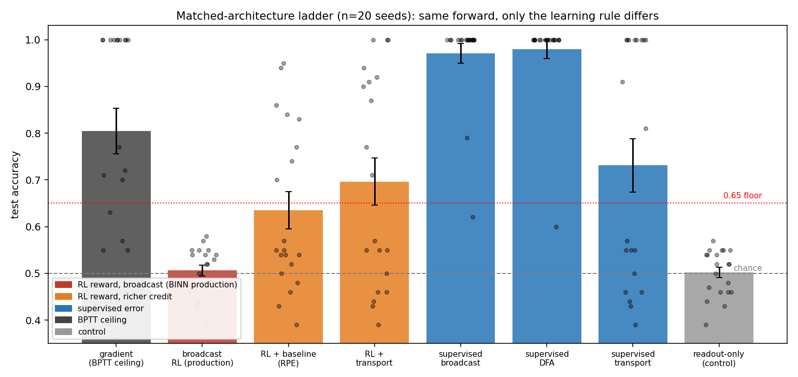
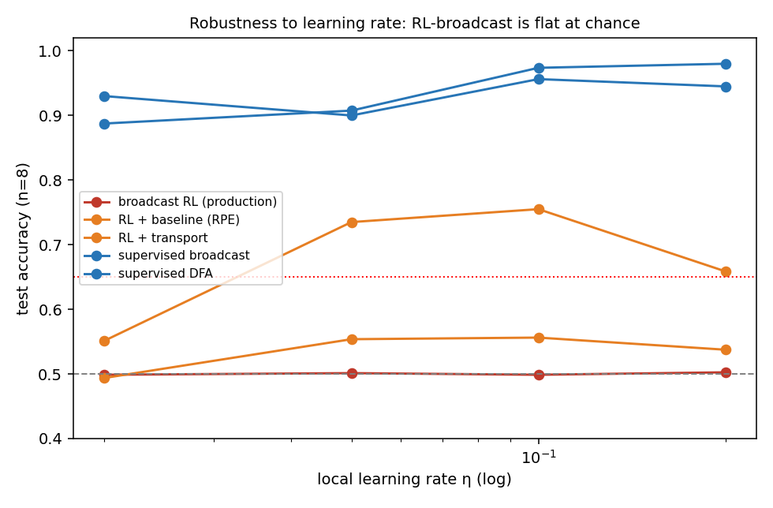
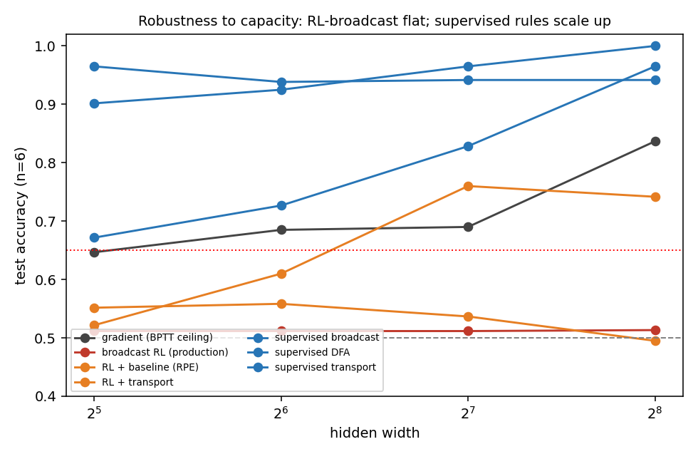

# Matched-Architecture Control — findings (NumPy preview)

**Unit:** C1-MATCH · **Date:** 2026-07-23 · **Status:** preview (NumPy); binding Rust n=20 pending
**Preregistration:** [`MATCHED_ARCH_CONTROL.md`](MATCHED_ARCH_CONTROL.md)
**Does NOT reopen** `c1-118207fbc3eaba53`. Confirms the v2 negative and localizes its cause.

---

## TL;DR

The Gate-G2 negative was ambiguous: the local path and the gradient reference did
not share a forward graph, so a low `gap_closed` could mean *"the local rule is
weak"* **or** *"the local path (encoder / k-WTA / single pass) is handicapped."*

This control removes that ambiguity. **One** shared feed-forward LIF forward is
trained by a ladder of rules that differ **only** in the weight update. The result
is sharper than "local learning fails":

> On the identical architecture, **local credit assignment is sufficient** — a
> supervised-error rule with even a *single broadcast scalar* solves the task
> (0.97), and fixed-random feedback (DFA, 0.98) matches it. What fails is the
> **reward-based learning signal** BINN uses in production: a sparse ±1 reward
> broadcast three-factor rule stays at **chance (0.51) across every learning rate
> and every width tested.** Improving the *credit* within the RL regime (baseline,
> weight transport) helps only partially and never reliably clears the floor.

So the operative variable behind the v2 FAIL is the **learning signal (sparse ±1
reward vs graded directional error)**, not credit locality and not the spiking
substrate. This both hardens the negative for the production rule *and* points to
a concrete, still-local fix.

## Design

All arms share `MatchedArch::forward` (feed-forward LIF, `win`+rate readout;
recurrence removed identically for every arm; θ, reset, leak from the engine).
Held identical: forward, width, encoding (continuous frames), epochs, data
splits, seed lineage. The ladder is a 2×3 contrast — **learning signal** ×
**credit locality** — plus two controls:

| Rule | Signal | Hidden credit | Note |
|---|---|---|---|
| `gradient` | — | exact BPTT | ceiling (not local) |
| `broadcast` | **RL reward ±1** | one broadcast scalar | **BINN production rule** |
| `rpe` | RL reward − baseline | one broadcast scalar | soft-RPE (the deferred variance fix) |
| `rl_transport` | RL reward − baseline | real `wout` (transport) | best credit *within* RL |
| `broadcast_sup` | **supervised error** | one broadcast scalar | scalar error, still broadcast |
| `dfa` | supervised error | fixed random feedback | local, per-neuron, no transport |
| `eprop` | supervised error | real `wout` (transport) | transport upper bound |
| `readout_only` | supervised error | **frozen hidden** | control: is the task readout-trivial? |

## Results (n=20 seeds, h=128, 80 epochs)



| Rule | Mean acc | ±SD | Reading |
|---|---:|---:|---|
| gradient (ceiling) | 0.804 | 0.216 | learns, but noisy (14/20 seeds ≥ 0.65) |
| **broadcast (production)** | **0.506** | 0.051 | **chance — FAIL** |
| rpe | 0.635 | 0.176 | barely above chance, high variance |
| rl_transport | 0.696 | 0.226 | partial, never reliably clears floor |
| **broadcast_sup** | **0.971** | 0.095 | **solves it (scalar supervised error)** |
| **dfa** | **0.980** | 0.089 | **solves it (fixed random feedback)** |
| eprop | 0.731 | 0.255 | works but transport-coupling is unstable |
| readout_only | 0.502 | 0.050 | chance → hidden credit is genuinely required |

Three things to note. (1) **`readout_only` = chance** — the task is not solvable by
the readout alone, so the hidden layer must do real credit assignment; the
comparison is meaningful. (2) The **supervised** local rules (`broadcast_sup`,
`dfa`) *outperform the BPTT ceiling itself* — the ceiling's misses are BPTT
optimization artifacts (surrogate-gradient dead units), not a representational
limit. Because the ceiling is noisy, the *absolute* accuracies are the robust
comparison; the gradient-relative `gap_closed` is deflated by ceiling noise and
should not be read as the primary metric here. (3) Within the RL regime, better
credit (`rl_transport` 0.70 > `broadcast` 0.51) helps *some*, but the regime as a
whole under-performs the supervised regime decisively.

## Robustness — the production failure is structural, not tuning

 

- **Learning rate** (η ∈ {0.02, 0.05, 0.1, 0.2}, n=8): `broadcast` RL is **flat at
  0.50 at every η**. Supervised rules sit at 0.89–0.98 throughout.
- **Capacity** (width ∈ {32…256}, n=6, η=0.1): `broadcast` RL is **flat at ~0.51
  across all widths**, while supervised rules and the ceiling *improve* with width
  (`dfa` 0.90→1.00). More neurons do nothing for the reward-broadcast rule.

A rule that is invariant to both learning rate and capacity is not undertuned; it
is the wrong learning signal for this credit problem.

## What this means for BINN

1. **The v2/G2 negative for the production rule is confirmed and localized.** With
   the spiking-path handicaps removed and exposure matched, the broadcast ±1-reward
   three-factor rule still cannot learn — so the FAIL is attributable to the
   **rule's reward signal**, not the encoder/k-WTA/single-pass path. This *hardens*
   U-NEG.
2. **"Can any local rule close the gap?" — yes, here.** `dfa` and `broadcast_sup`
   close it, both fully local, no backprop-through-time, no weight transport. Local
   credit assignment was never the barrier on this task.
3. **Actionable, still-local fix for BINN.** The change that matters is the
   *modulator*: replace the sparse ±1 reward with a **graded, directional teaching
   signal** — a readout error, a predictive-coding target, or a critic-derived RPE
   with real per-sample gradation (not just a running-mean subtraction, which
   `rpe` shows is too weak). This stays inside the three-factor family; it does not
   require abandoning locality or adopting backprop.

## Honest caveats

- **Preview, not verdict.** NumPy port of the coincidence task, not the Rust n=20
  harness under the protocol-v4 hash. The Rust run is the binding result.
- **Feed-forward simplification.** Recurrence was removed (identically for all
  arms) after it was shown unnecessary for coincidence and dominated runtime.
- **"Supervised error" needs a target at the output.** That is legitimate in a
  labeled classification setting and the hidden credit stays local — but it is a
  departure from BINN's reward-driven biological framing. The precise reframe is
  therefore **reward vs error**, not *local vs backprop*.
- **One simple task.** Coincidence detection is deliberately minimal. The signal
  here (reward-regime failure, supervised-regime success) should be re-checked on
  harder, compositional tasks before any general claim.
- **Ceiling reliability.** The BPTT ceiling learns on only 14/20 seeds; treat it as
  a noisy reference, not a tight bound.

## Reproduce

```bash
# n=20 ladder (chunk-resumable JSONL)
python3 scripts/matched_arch_experiments.py --h 128 --epochs 80 \
  --n-train 160 --n-test 100 --eta 0.05 --jsonl results/ladder_ff.jsonl \
  --seed-start 0 --seed-end 20
# sweeps + figures were produced from results/sweep_eta.json, sweep_capacity.json
```
