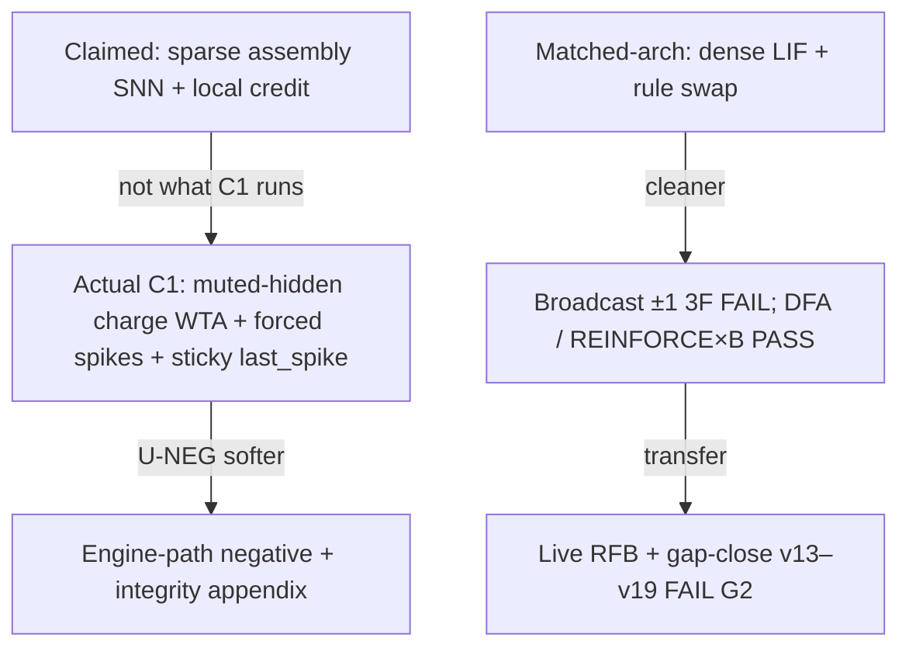

# BINN paper skeleton — negative result + methods

> ### SUPERSEDED IN PART — 2026-08-25 matched-architecture re-run
>
> Every matched-architecture number in this document was produced before the
> 2026-08-22 silent-initialisation repair, on a forward pass that emitted **zero
> spikes at any seed**, and none of them has been regenerated here. The re-run
> is [`RESULT_2026-08-25_MATCHED_ARCH_RERUN.md`](RESULT_2026-08-25_MATCHED_ARCH_RERUN.md)
> and [`PAPER_DRAFT.md`](PAPER_DRAFT.md) §3.1 carries the current figures.
>
> **The lead negative survives** — broadcast ±1 three-factor is at chance on both
> forward graphs. **Three contrasts do not**: the discrete EventProp-style
> spike-adjoint goes 0.5000 FAIL to 0.9450 / 0.8900 PASS, and the two RL
> broadcast contrasts go 0.5250 to 0.9100 and 0.5113 to 0.7962. The gradient
> ceiling goes 0.8887-0.9150 to **1.0000**, so every `gap_closed` here divides by
> a different denominator than the instrument now produces.
>
> The `c1-*` config hashes cited below are **retired**: `MATCHED_INPUT_SCALE` was
> not part of them, so each named two experiments. They no longer resolve, by
> design. The retirement table is in the re-run document section 8.
>
> Rows concerning the SHD attention campaign, the live-transfer package and the
> XOR task are unaffected: none of them runs on the matched dense-LIF forward.

> **CITATION WARNING (added 2026-08-07).** This document cites the
> `track-b-rescue` **v130** row (`1.0000`, gap LCB `0.9988`, PASS matched) as a
> matched-substrate result. That report is stale: the source is **v131**, and the
> 130→131 bump is precisely the clamp-and-separation-gate fix for the defect the
> row exhibits. Under current code the arm **cannot be reported as PASS**. Do not
> cite it until `track-b-rescue` has been re-run. The DFA
> (`c1-dfa-c8c4fe0899908b84`) and RL (`c1-rl-42eddc9c801308e9`) matched PASSes are
> **not** affected by this defect; they ran through the clamped `runner.rs` path.
> See `AUDIT_2026-08-07_JULY_CAMPAIGN_SCORING_PATH.md` and
> `TODO_2026-08-07_OPEN_WORK.md` §1.
> **RESOLVED 2026-08-19.** The re-run landed. At v131 the arm reports
> **INVALID_HARNESS**, not PASS: the ceiling-inverted warning fires on 3 of 20
> learned-FB seeds and the code refuses to emit a PASS while it is present.
> The v130 PASS is **withdrawn**. See
> `RESULT_2026-08-19_TRACK_B_V130_PASS_WITHDRAWN.md` and
> `track_b_results_v131.md`.


Claim authority: [`PUBLISHABLE_CLAIMS.md`](PUBLISHABLE_CLAIMS.md).  
Cite-every-number: [`PAPER_RESULTS_TABLE.md`](PAPER_RESULTS_TABLE.md).  
Prose draft: [`PAPER_DRAFT.md`](PAPER_DRAFT.md).  
Figures: [`PAPER_FIGURE_SPEC.md`](PAPER_FIGURE_SPEC.md).  
Repro: [`REPRO_ARTIFACT_CHECKLIST.md`](REPRO_ARTIFACT_CHECKLIST.md).  
Campaign freeze: [`CAMPAIGN_2026-07-23_CLAIM_FREEZE.md`](CAMPAIGN_2026-07-23_CLAIM_FREEZE.md).  
Do not invent; cite on-disk notes / hash replay only.

**Venue fit:** negative-results / local-learning / methods tracks (not “brain-like AI” venues unless claim language is rewritten down).

**Status:** experimental series closed (matched P1–P9 + gap-close v14–v19). Camera-ready package hardened 2026-07-23/24.

---

## Title options (broadcast ±1 three-factor / matched controls)

1. Broadcast ±1 Three-Factor Credit Fails a Matched Dense-LIF Coincidence Gate
2. When the Forward Is Held Fixed: A Negative Result for Scalar ±1 Broadcast Plasticity
3. Matched-Architecture Controls Soften Spiking Negatives: Broadcast ±1 Three-Factor Still Insufficient
4. Rich Local Credit Clears a Matched Gate; Live k-WTA Transfer Does Not
5. Separating Rule Topology from Spiking Front-Ends in a Preregistered Local-Learning Kill-Gate

Avoid: “digital brain,” “Assembly Calculus fails,” “proves local learning impossible,” “REINFORCE rescues live C1,” bare “broadcast credit topology” (use **broadcast ±1 three-factor**).

---

## Abstract (filled draft)

Broadcast ±1 three-factor plasticity fails a preregistered accuracy/gap bar when the dense-LIF forward is held identical to a SuperSpike BPTT reference (matched-arch `c1-match-5dc6822e71229e9e`: local 0.5000, gap LCB 0.0000). On that same forward, graded DFA and REINFORCE×frozen per-neuron feedback clear the gate at the 80-epoch budget (`c1-dfa-c8c4fe0899908b84` PASS, gap LCB 0.6894; `c1-rl-42eddc9c801308e9` PASS, gap LCB 0.6846). Online learned feedback alignment is **withdrawn** (v131 reports `INVALID_HARNESS`). An A6 ceiling health audit reveals the 80-epoch reference is still climbing (0.9013 at e80 vs 1.0000 at e640), so the coincidence gate reflects learning speed rather than asymptotic capacity. Honesty: DFA-schedule broadcast-graded = **0.9863** — lead FAIL is ±1 three-factor, not any broadcast. Locality flip = XOR. The event-driven C1 pipeline under canonical hash `c1-118207fbc3eaba53` likewise fails Gate G2 (local 0.4912) and should be read as an operationalized pipeline negative with disclosed integrity limits (sticky STDP pairing, partial membrane reset, θ=∞ mute). Live transfer of the matched REINFORCE family onto k-WTA C1 fails (`c1-660401d74db3c88d`); structured feedback and capacity schedules clear the accuracy floor but not gap LCB > 0.5. On SHD, a time-axis attention readout reaches **0.8320** at `d32/L4` (12/12 seeds ≥ 0.80, gain **+0.1258** over plain LIF), with temporal order confirmed as the mechanism (96% drop under shuffling; +0.1337 drop in 12/12 seeds). We do not claim biology, Assembly Calculus success, or impossibility.

---

## 1. Introduction — narrow hypothesis

- Prior rhetoric (“sparse assemblies learn without backprop”) ≠ coded object.
- Narrow H₀: **broadcast ±1 three-factor** (eligibility × ±1) is insufficient on a matched dense-LIF coincidence forward under a preregistered accuracy/gap bar.
- Contrast H₁: **richer / more local credit** (DFA, REINFORCE×`B`) can clear the same matched gate.
- Transfer H₂: matched PASS does **not** imply live k-WTA C1 PASS under honest mapping + gap-close suite.
- Neuromorphic H₃: time-axis self-attention readout unlocks temporal order on SHD audio benchmark.
- Engine C1 is a softer operationalized H₀ with integrity disclosure.
- Mechanism H\*: richness × addressability + substrate barrier (Figure M) and temporal order (SHD).
- Popper framing: severe tests of operationalized hypotheses, not proofs about brains.

---

## 2. Methods — object under test

### 2.1 Claimed vs actual (figure)



**Figure M (required):** richness × addressability 2×2 + XOR row — see [`PAPER_FIGURE_SPEC.md`](PAPER_FIGURE_SPEC.md). Caption lead FAIL = **broadcast ±1 three-factor**.
### 2.2 Matched-arch (primary)

- Sources: `matched_local_baseline.rs`, `match_config.rs`, `runner_match.rs`, `dfa_match_*`, `rl_match_*`
- Fixed: forward, width, frames, rate readout, epochs, splits, seeds, LIF constants
- Varied: update rule only
- Gate: same numeric thresholds as G2; hash families `c1-match-*`, `c1-dfa-*`, `c1-rl-*`

### 2.3 Engine C1 (secondary)

- Sources: `runner.rs`, `three_factor.rs`
- LatencyEncoder → event engine → θ=∞ integrate → k-WTA force-select → three-factor
- References: SurrogateLifReference / eligibility reference on same splits

### 2.4 Live RFB + gap-close

- v13: `--reinforce-fb` · [`MATCHED_ARCH_LIVE_REINFORCE.md`](MATCHED_ARCH_LIVE_REINFORCE.md)
- v14–v19: [`GAP_CLOSE_RFB_TRANSFER.md`](GAP_CLOSE_RFB_TRANSFER.md)
- Positive control stays broadcast ±1; G2 floors unchanged

### 2.5 SHD attention readout

- Dataset: Spiking Heidelberg Digits (SHD), 20 classes.
- Model: `ff+fixed+attn` (time-axis causal multi-head self-attention readout) vs `ff+fixed` (mean-rate readout).
- Contrasts: depth, width, geometries, and temporal shuffling controls (`bin-shuffled`, `channel-shuffled`).

### 2.6 Integrity limitations

See §Appendix A and [`PUBLISHABLE_CLAIMS.md`](PUBLISHABLE_CLAIMS.md).

---

## 3. Primary results — matched-arch

| Item | Hash | Verdict | Primary | Gap LCB | Note |
|---|---|---|---:|---:|---|
| Broadcast ±1 3F (v4) | `c1-match-5dc6822e71229e9e` | **FAIL** | 0.5000 | 0.0000 | [`c1_match.md`](c1_match.md) |
| DFA (v5) | `c1-dfa-c8c4fe0899908b84` | **PASS** | 0.9387 | 0.6894 | [`c1_dfa.md`](c1_dfa.md) |
| RL reinforce_fb (v12) | `c1-rl-42eddc9c801308e9` | **PASS** | 0.9200 | 0.6846 | [`c1_rl.md`](c1_rl.md) |
| RL Online Learned `B_i` (v130) | `track-b-rescue` | **WITHDRAWN** | — | — | v131 `INVALID_HARNESS` |
| Discrete EventProp (v28) | `c1-eventprop-5bb083d5e88d0ad2` | **FAIL** | 0.5000 | 0.0000 | [`c1_eventprop.md`](c1_eventprop.md) |
| RL graded (v11) | `c1-rl-ef504db58916720d` | **FAIL** | 0.5900 | 0.0182 | archived |

**Figure 1:** Rule-swap schematic (forward fixed).  
**Figure 2:** Matched means — broadcast ±1 3F vs DFA vs RL vs gradient.  
**Figure M:** Mechanism richness×addressability (incl. broadcast-graded **0.9863** + XOR locality flip).  
**Table 1:** Gate thresholds + verdicts (above).  
**A6 Caveat:** Reference reaches 1.0000 at e640; e80 gate reflects learning speed.

### Honesty note (required in §3)

On the DFA matched schedule, **broadcast-graded** contrast = **0.9863**. Lead FAIL is **broadcast ±1 three-factor**, not “any broadcast.” Locality flip = XOR ([`deep_xor_thresh.json`](deep_xor_thresh.json)), not coincidence alone. Discrete EventProp H2H **FAIL** (`c1-eventprop-5bb083d5e88d0ad2`). v131 is matched-only. See [`PAPER_RESULTS_TABLE.md`](PAPER_RESULTS_TABLE.md) Table A.

---

## 4. Secondary results — Engine C1 / Gate G2

| Item | Hash | Verdict | Local | Gap LCB |
|---|---|---|---:|---:|
| Canonical C1 / G2 | `c1-118207fbc3eaba53` | **FAIL** | 0.4912 | −0.0048 |
| Trial isolation | `c1-8ec031907a3426d0` | **FAIL** | 0.5188 | (mean 0.2109) |
| Capacity sensitivity | `c1-d38d7644d8afc84b` | **FAIL** | 0.6775 (floor ✓) | 0.0000 |
| Temporal-PC | `c1-a49deeaedb495a09` | **FAIL** | 0.5263 | (mean 0.0947) |

**Figure 3:** Condition means (local / dense / gradient / eligibility) from [`c1_g2.md`](c1_g2.md).  
**Box:** Integrity caveats H1–H2, θ=∞, `project` unused on v2.

Interpretation: pipeline FAIL under disclosed object; does not alone prove rule insufficiency (that’s matched-arch’s job).

---

## 5. SHD Attention Read-out & Mechanism

| Configuration | Accuracy | Control | Gain | Mechanism (shuffle drop) |
|---|---:|---:|---:|---:|
| **d32/L4 headline (e400)** | **0.8320** (12/12 ≥ 0.80) | 0.7062 | **+0.1258** | **+0.1337** (12/12 seeds) |
| d32/L1 (Wave 1) | 0.7483 | 0.7062 | +0.0421 | +0.1041 |
| Sample efficiency (e10) | 0.7337 (98.1% of e400) | 0.5336 | +0.2002 | — |

- **Mechanism:** Temporal order confirmed (+0.1337 drop vs plain arm's +0.0128; 96% of benefit lost under shuffling).
- **Scope:** Scoped to h128 / `adjacent-sum-5` / `published-2ms`; width inversion at h1024 (−0.1618); resolution mechanism (S-5) refuted; uncalibrated.

---

## 6. Transfer results — live RFB + gap-close

| Protocol | Hash | Verdict | Local | Gap LCB |
|---|---|---|---:|---:|
| v13 live RFB | `c1-660401d74db3c88d` | **FAIL** | 0.4900 | 0.0737 |
| v14 epoch | `c1-714c115e14a3eeed` | **FAIL** | 0.4838 | −0.0100 |
| v15 structured B | `c1-493ddd56f8714fb6` | **FAIL** | **0.7262** | 0.2567 |
| v16 structured×epoch | `c1-677df7f7cbe4f8ec` | **FAIL** | 0.5200 | 0.0844 |
| v17 structured×capacity | `c1-983ee5303c00b147` | **FAIL** | **0.6825** | **0.3127** |
| v18 elig×REINFORCE | `c1-c7d2c86a2b1927f6` | **FAIL** | **0.7125** | 0.2351 |
| v19 structured×teach | `c1-dfab4a7ec19f17c2` | **FAIL** | **0.6700** | 0.2238 |

**Reading:** structured `B` clears accuracy floor; best gap LCB is v17 (0.3127) still < 0.5; teach restore (v19) does not beat v15; do not claim live rescue. v131 `live-transfer-rescue` is **matched-only** (misnamed) — not a live PASS.

Also cite P4 spiking DFA FAIL (`c1x-dfa-spike-true-dfa-a911e793e590b0ed`, gap LCB 0.0733) as one honest attempt.

---

## 7. Task evidence (optional)

| Exp | Finding | Cite |
|---|---|---|
| `xor_thresh` | broadcast 0.501 / DFA 0.827 / grad 0.773 — **locality flip** | 1-layer XOR only |
| `depth_locality` mid | broadcast 0.816 / DFA 0.825 / rl_fb 0.803 — not a locality flip | P7 careful close |

---

## 8. Discussion / limitations (full — see [`PAPER_DRAFT.md`](PAPER_DRAFT.md) §4)

### 8.1 Lead + mechanism

- Lead with **broadcast ±1 three-factor** mechanism claim from matched-arch; contrast with DFA / REINFORCE PASSes.
- **A6 Ceiling Health Caveat:** Gradient reference climbs to 1.0000 by e640; e80 gate reflects *learning speed*, not asymptotic capacity.
- Cite **Figure M**: richness × addressability (incl. 0.9863) + XOR locality flip.
- **Falsifier:** matched ±1 clearing gap LCB under the same dense-LIF forward overturns the lead claim.

### 8.2 Transfer + soft-WTA temperature honesty

- Transfer: dense continuous PASS ≠ hard k-WTA / sparse eligibility PASS; floor ≠ gate.
- Hybrid soft→hard collapse at **T=2.0** (appendix) ≠ live v21 soft-WTA at **T=1**.

### 8.3 Baselines / EventProp

- Ceiling: **SuperSpike BPTT** (matched primary).
- True σ′ e-prop: footnote only (`c1x-eprop-true-*`).
- **Discrete EventProp-style H2H FAIL** — `c1-eventprop-5bb083d5e88d0ad2` (mean 0.5000 / gap LCB 0.0000); disclose ≠ continuous Wunderlich–Pehle.

### 8.4 F1 / F2 / F5 honesty

- **F1:** spike reset = sequential scan barrier; sub-threshold scan only partial.
- **F2:** local learning removes BPTT unroll, not sequential forward time.
- **F5:** activity ≠ compute; work-per-accuracy includes per-event overhead.

### 8.5 Appendix-only G3 / G4 / H0

- G3 FAIL / G4 NO-GO / hybrid H0 → [`APPENDIX_POST_G2.md`](APPENDIX_POST_G2.md) only.
- Banner does **not** reopen G2.
- G4 NO-GO → stop scaling areas under ±1; Micro (if ever) = stress/engineering, not Foundation unlock.

### 8.6 Neuromorphic scope & Non-claims

- Explicit non-claims list from [`PUBLISHABLE_CLAIMS.md`](PUBLISHABLE_CLAIMS.md) (incl. no live rescue from matched PASS; floor ≠ gate; no “any broadcast” ban; no temporal-resolution mechanism for attention; no attention calibration claim; withdrawals for v130 learned-FB, deep-snn v134, and shd-scientific-sweep).
- Integrity fix ⇒ **new hash**; never silent threshold reopen of v2.

---

## 9. Reproducibility

Point to [`REPRO_ARTIFACT_CHECKLIST.md`](REPRO_ARTIFACT_CHECKLIST.md):

```bash
# Matched series
cargo run --locked --release -p binn-lab --bin c1 -- --matched-arch --config-hash c1-match-5dc6822e71229e9e
cargo run --locked --release -p binn-lab --bin c1 -- --matched-dfa --config-hash c1-dfa-c8c4fe0899908b84
cargo run --locked --release -p binn-lab --bin c1 -- --matched-rl --config-hash c1-rl-42eddc9c801308e9
# Canonical + live transfer
cargo run --locked --release -p binn-lab --bin c1 -- --config-hash c1-118207fbc3eaba53
cargo run --locked --release -p binn-lab --bin c1 -- --reinforce-fb --config-hash c1-660401d74db3c88d
cargo run --locked --release -p binn-lab --bin c1 -- --structured-fb --config-hash c1-493ddd56f8714fb6
cargo run --locked --release -p binn-lab --bin c1 -- --structured-fb-capacity --config-hash c1-983ee5303c00b147
```

CI: `cargo test --locked --workspace` + GC scripts per `binn/README.md`.

---

## Appendix A — Integrity limitations

| Bug / limit | Code | Paper language |
|---|---|---|
| H1 sticky `last_spike` | `three_factor.rs`; `clear_eligibility` in `runner.rs` | “Cross-trial STDP pairing state retained on v2; eligibility zeroed, spike times not.” |
| H2 partial membrane reset | `runner.rs` vs C3 `reset_dynamic_state` | “C1 lacks C3-style dendrite/branch/`last` reset on v2.” |
| θ=∞ mute | `runner.rs` | “Hidden integrate window suppresses natural spiking on v2.” |
| `project` unused on v2 | `project.rs` vs C1 | “AC projection exercised only under `c1-project-*` (FAIL).” |
| Hybrid e-prop label | `runner_credit.rs` | “Eligibility × transported modulator; not textbook e-prop.” |

---

## Figure ↔ binary / hash map

| Figure / table | Binary | Hash / note |
|---|---|---|
| Fig. matched means | `c1 --matched-arch/--matched-dfa/--matched-rl` | §3 hashes |
| **Fig. M mechanism** | matched + XOR deep suite | 0.9863 from `c1_dfa.md`; XOR from `deep_xor_thresh.json` |
| Fig. C1 conditions | `c1` | `c1-118207fbc3eaba53` → `c1_g2.md` |
| Fig. transfer ladder | `c1 --reinforce-fb` / gap-close flags | §5 hashes → `GAP_CLOSE_RFB_TRANSFER.md` |
| Table credit arms | `credit-assignment` | `c1x-*` in `credit_assignment.md` |

Where a draft needs a number not yet pasted: write **“fill from replay”** and run the hash command — do not invent.
