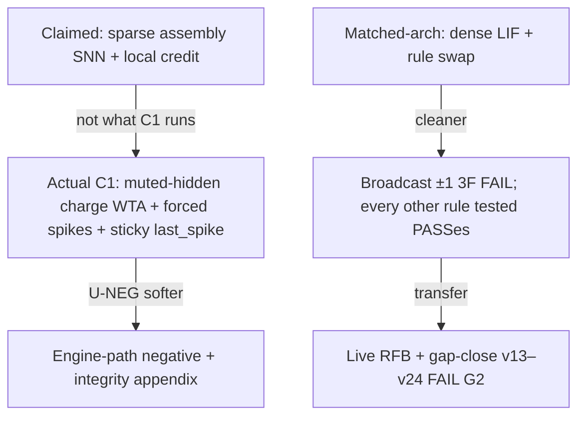

# BINN paper skeleton — SHD attention read-out (primary) + matched-architecture kill gate (secondary)

> ### SUPERSEDED IN PART — 2026-08-25 matched-architecture re-run
>
> Every matched-architecture number in this document was produced before the
> 2026-08-22 silent-initialisation repair, on a forward pass that emitted **zero
> spikes at any seed**, and none of them has been regenerated here. The re-run
> is [`RESULT_2026-08-25_MATCHED_ARCH_RERUN.md`](RESULT_2026-08-25_MATCHED_ARCH_RERUN.md)
> and [`PAPER_DRAFT.md`](PAPER_DRAFT.md) §3.1 carries the current figures.
>
> **The lead negative survives** — broadcast ±1 three-factor is at chance on both
> forward graphs. **Three contrasts do not**: the discrete EventProp-style
> spike-adjoint goes 0.5000 FAIL to 0.9450 / 0.8900 PASS, and the two RL
> broadcast contrasts go 0.5250 to 0.9100 and 0.5113 to 0.7962. The gradient
> ceiling goes 0.8887-0.9150 to **1.0000**, so every `gap_closed` here divides by
> a different denominator than the instrument now produces.
>
> The `c1-*` config hashes cited below are **retired**: `MATCHED_INPUT_SCALE` was
> not part of them, so each named two experiments. They no longer resolve, by
> design. The retirement table is in the re-run document section 8.
>
> Rows concerning the SHD attention campaign, the live-transfer package and the
> XOR task are unaffected: none of them runs on the matched dense-LIF forward.

> **CITATION WARNING (added 2026-08-07).** This document cites the
> `track-b-rescue` **v130** row (`1.0000`, gap LCB `0.9988`, PASS matched) as a
> matched-substrate result. That report is stale: the source is **v131**, and the
> 130→131 bump is precisely the clamp-and-separation-gate fix for the defect the
> row exhibits. Under current code the arm **cannot be reported as PASS**. Do not
> cite it until `track-b-rescue` has been re-run. The DFA
> (`c1-dfa-c8c4fe0899908b84`) and RL (`c1-rl-42eddc9c801308e9`) matched PASSes are
> **not** affected by this defect; they ran through the clamped `runner.rs` path.
> See `AUDIT_2026-08-07_JULY_CAMPAIGN_SCORING_PATH.md` and
> `TODO_2026-08-07_OPEN_WORK.md` §1.
> **RESOLVED 2026-08-19.** The re-run landed. At v131 the arm reports
> **INVALID_HARNESS**, not PASS: the ceiling-inverted warning fires on 3 of 20
> learned-FB seeds and the code refuses to emit a PASS while it is present.
> The v130 PASS is **withdrawn**. See
> `RESULT_2026-08-19_TRACK_B_V130_PASS_WITHDRAWN.md` and
> `track_b_results_v131.md`.


Claim authority: [`PUBLISHABLE_CLAIMS.md`](PUBLISHABLE_CLAIMS.md).  
Cite-every-number: [`PAPER_RESULTS_TABLE.md`](PAPER_RESULTS_TABLE.md).  
Prose draft: [`PAPER_DRAFT.md`](PAPER_DRAFT.md).  
Figures: [`PAPER_FIGURE_SPEC.md`](PAPER_FIGURE_SPEC.md).  
Repro: [`REPRO_ARTIFACT_CHECKLIST.md`](REPRO_ARTIFACT_CHECKLIST.md).  
Campaign freeze: [`CAMPAIGN_2026-07-23_CLAIM_FREEZE.md`](CAMPAIGN_2026-07-23_CLAIM_FREEZE.md).  
Do not invent; cite on-disk notes / hash replay only.

> **Reframed 2026-08-27.** the read-out program (the SHD attention read-out) now **leads**;
> the matched-architecture kill gate is **secondary**. This file's ordering,
> hypothesis IDs, figure map and abstract were rewritten to match
> [`PAPER_DRAFT.md`](PAPER_DRAFT.md)'s first Abstract block. Section numbers
> moved: old §5 (SHD) → **§3**, old §3 (matched) → **§4**, old §4 (Engine C1) →
> **§5**. §6–§9 keep their numbers.

**Venue fit (reconsidered 2026-08-27 — the previous judgement was made on the now-demoted program).**
The old line — “negative-results / local-learning / methods tracks” — was a fit
for a paper whose lead was a kill-gate FAIL. The lead is now a **positive,
preregistered measurement**: a difference-in-differences on which component's
marginal contribution is order-dependent. That changes the target class:

| Class | Fit under the new lead | Why |
|---|---|---|
| Neuromorphic / SNN methods & measurement | **Best fit** | Lead is an SHD read-out mechanism result with a destruction-operator control; §0 of [`PAPER_DRAFT.md`](PAPER_DRAFT.md) positions it against TA-SNN / STSC-SNN / DCLS / SE-adLIF. |
| General ML methods / evaluation-and-measurement tracks | Good fit | The contribution is a *measurement design* (difference-in-differences on the gain), not an accuracy record. |
| Negative-results tracks | **Demoted, not dropped** | Still the right home for §4–§6 (matched ±1 FAIL, live-transfer FAIL) if those are split out as their own paper. |
| “Brain-like AI” venues | **Avoid** | Unchanged: claim language would have to be rewritten down. |

Two constraints on any venue choice, both from [`PAPER_DRAFT.md`](PAPER_DRAFT.md)
§0 and §3.8, and neither optional: **0.8332 is not competitive** (the SHD
frontier is 95–96.4%), so this cannot be submitted as a leaderboard result; and
the instrument is **`Uncalibrated`** at compile time (§4.6), so no calibration
claim may accompany it.

[`VENUE_FORMATTING.md`](VENUE_FORMATTING.md) still carries the pre-reframe
judgement and its “required main-text disclosures” list still names the retired
EventProp FAIL — **it has not been updated by this edit** and must be brought
forward separately.

**Status.**
- **Matched-architecture series: CLOSED.** Matched P1–P9 + gap-close v14–v19, camera-ready package hardened 2026-07-23/24, re-run on both forward graphs 2026-08-25 ([`RESULT_2026-08-25_MATCHED_ARCH_RERUN.md`](RESULT_2026-08-25_MATCHED_ARCH_RERUN.md)).
- **SHD attention campaign: OPEN.** Waves 15–17 landed 2026-08-27 ([`RESULT_2026-08-27_W15_17_THE_COLLAPSE_IS_A_THRESHOLD.md`](RESULT_2026-08-27_W15_17_THE_COLLAPSE_IS_A_THRESHOLD.md)). **Waves 18–20 are running now**: `w18dep` / `w19int` under [`PREREG_2026-08-27_DEPTH_IS_NOT_MONOTONE_AT_H1024.md`](PREREG_2026-08-27_DEPTH_IS_NOT_MONOTONE_AT_H1024.md), `w20rec` under [`PREREG_2026-08-27_THE_RECURRENT_CLAIM_AT_THIRTY_TWO_SEEDS.md`](PREREG_2026-08-27_THE_RECURRENT_CLAIM_AT_THIRTY_TWO_SEEDS.md). **§3's scope-limit rows and §3's substrate rows are therefore not frozen**; the headline and the mechanism contrast at n=32 are.

---

## Title options

**Lead-with-the-conditional (current framing).** The claim is not “attention
helps” and not “SHD depends on temporal order” — both are prior art
([`PAPER_DRAFT.md`](PAPER_DRAFT.md) §0). It is *which component's marginal
contribution is the order-dependent one*.

1. What a Time-Axis Read-Out Buys Is Temporal Order: A Difference-in-Differences on SHD
2. Whose Contribution Is Order-Dependent? Separating a Read-Out's Gain from the Task's Temporal Structure
3. The Gain, Not the Accuracy: Measuring Which Component a Bin-Shuffle Destroys
4. A Read-Out Advantage That Does Not Survive Its Own Shuffle Control — and a Rate Read-Out That Does
5. Attention at the Read-Out Recovers Temporal Order a Spiking Substrate Does Not Represent — Scoped, and With a Width Collapse It Cannot Explain

**Alternatives, for a matched-gate-led framing** (retained from the pre-2026-08-27
skeleton; use only if §4–§6 are split out as their own paper):

A. Broadcast ±1 Three-Factor Credit Fails a Matched Dense-LIF Coincidence Gate
B. When the Forward Is Held Fixed: A Negative Result for Scalar ±1 Broadcast Plasticity

Avoid: “digital brain,” “Assembly Calculus fails,” “proves local learning
impossible,” “REINFORCE rescues live C1,” bare “broadcast credit topology” (use
**broadcast ±1 three-factor**). New to this list: **“attention improves SHD”** as
a headline (prior art), **“96% of SHD accuracy depends on temporal order”** (that
is not what was measured — the 94.5% / 96% figure is the fraction of the
*read-out's advantage* that is contingent on order, not of accuracy), and any
phrasing that reports the gain without the rate read-out's own shuffle cost
beside it.

---

## Abstract (filled draft — mirrors [`PAPER_DRAFT.md`](PAPER_DRAFT.md) Abstract block 1)

Adding a time-axis attention read-out to a spiking network raises SHD accuracy from 0.7057 to **0.8332** (gain **+0.1275**, positive in 32/32 seeds, 32/32 at or above 0.80). That much is unsurprising and not new. The result this paper is built on is the **conditional**: when the temporal order of the input is destroyed by permuting time bins — independently per sample, in **both** the training and test splits, so the task itself becomes rate-solvable — the read-out's *advantage over a rate read-out* collapses by **+0.1347**, while the rate read-out loses only **+0.0142** of its own. A **9.5× ratio, 32/32 seeds**, same seeds and same splits. This is a difference-in-differences on the **gain**, not on accuracy: it asks which *component's* marginal contribution is order-dependent, and we find no published equivalent for any read-out on any neuromorphic benchmark. That “SHD depends on temporal order” is already established (Cramer et al. 2022; and two 2025 studies) and is not claimed here.

Three scope limits are stated against it rather than in a footnote. The gain **inverts at width h1024** (−0.1618), and on a six-rung ladder that inversion is a **threshold** — a 0.2178 drop, 6.9× the largest gap below it — not a continuing slope; three preregistered rescue levers all fail, so the collapse is **located but unexplained**. The 0.80 clearance is geometry-specific (0.7864 on `channels-700`). And **0.8332 is not competitive**: the SHD frontier sits at 95–96.4% via learned delays, adaptation, and spiking transformers. This instrument carries **no temporal kernel of any kind** and lands where the literature puts a no-delay recurrent SNN; four preregistered ablations fail to explain the 0.087 residual against a delay-free reference, and the term-by-term reading attributes it to a 25-tap learned kernel per synapse the reference has and the instrument does not — an attribution resting on elimination and code-reading, **not on an ablation that added the kernel**, and the paper's weakest load-bearing inference.

A second, **secondary** program reports a preregistered matched-architecture kill gate. Broadcast ±1 three-factor plasticity — surrogate eligibility times a single ±1 reward — stays at chance on **both** matched dense-LIF forward graphs (feed-forward 0.5000, gap LCB 0.0000; recurrent 0.5100, LCB −0.0192) against a SuperSpike BPTT reference at 1.0000, n = 20 seeds. **Every other rule tested now clears that gate** — graded DFA 0.9925 / 0.9875, REINFORCE × frozen per-neuron feedback 0.9950 / 0.9812, broadcast graded error 0.9975, discrete EventProp-style spike-adjoint 0.9450 / 0.8900 — so the task separates one rule from a field that otherwise saturates and **no longer ranks the field**. Live k-WTA transfer of the matched REINFORCE and DFA families remains a scoped **negative** across twelve gap-close variants (v13–v24), best gap LCB 0.3127 against a 0.5 bar. We do not claim biology, Assembly Calculus success, neuromorphic deployment, calibration, or impossibility of local learning in principle.

---

## 1. Introduction — narrow hypotheses

Hypothesis IDs were renumbered 2026-08-27. **H0 is now the SHD conditional**;
the matched-architecture hypotheses follow it.

- **H0 — SHD conditional (primary).** The attention read-out's *marginal contribution* is order-dependent in a way the rate read-out's is not: attention's bin-shuffle cost **+0.1347** against the rate read-out's own **+0.0142**, same seeds, same splits, same destruction operator — **9.5×, 32/32**. Not “attention helps” (prior art) and not “SHD needs temporal order” (prior art). §3.
- **H1 — matched narrow negative (secondary).** **Broadcast ±1 three-factor** (surrogate eligibility × ±1) is insufficient on a matched dense-LIF coincidence forward under a preregistered accuracy/gap bar. §4.
- **H2 — matched contrast.** Richer / more local credit (graded DFA, REINFORCE × frozen `B`) clears the same matched gate. §4.
- **H3 — transfer.** A matched PASS does **not** imply a live k-WTA C1 PASS under honest mapping + the gap-close suite. §6.
- **H4 — engine C1.** A softer operationalized negative on the hashed production loop, with integrity disclosure. §5.

**Mechanism claims — two, and they are not the same claim.** The pre-2026-08-27
skeleton welded them into one `H*` bullet; they run on different programs, different
substrates and different evidence, and must never be cited as a single line.

- **M-1 — richness × addressability (matched program).** Modulator richness and feedback addressability are the material factors on the matched gate; the addressability half is evidenced on one-layer XOR, not by coincidence alone. Figure M. §4.
- **M-2 — temporal order (SHD program).** What the time-axis read-out consumes is temporal order: its advantage is contingent on order in a way the rate read-out's is not (H0), it is indifferent to threshold adaptation, and it is *larger* where the substrate is recurrent. §3.

Popper framing: severe tests of operationalized hypotheses, not proofs about
brains.

---

## 2. Methods — objects under test

### 2.1 SHD attention read-out (primary)

- Dataset: Spiking Heidelberg Digits (SHD), 20 classes; event cache under `data/shd/events/`.
- Model: `ff+fixed+attn` (time-axis self-attention read-out) against `ff+fixed` (unweighted mean-rate read-out). Substrate axes: `ff+alif`, `rec+fixed`, `rec+alif`.
- **Two properties of the block bound what the result can mean and must be stated, not footnoted** ([`PAPER_DRAFT.md`](PAPER_DRAFT.md) §2.3): it is **not causal** — a full `[T, T]` row-softmax with no mask, so the arm consumes the whole utterance at inference — and it is **single-head**, depth supplied by stacking `L` blocks rather than by splitting heads. Positional information is a fixed sinusoidal code; without it the mean-pooled block is permutation-invariant. Every arm is trained by the matched BPTT instrument, so the read-out is a **gradient reference** and no locality claim is made for it. *(The pre-2026-08-27 skeleton described this block as "causal multi-head". Both halves were wrong.)*
- Anchor operating point: h128 / `published-2ms` / `adjacent-sum-5` / `d32/L4` / e400.
- **Destruction operator:** `--temporal bin-shuffled` — bins permuted independently per sample in **both** train and test splits, so the task becomes rate-solvable rather than merely harder. Companion operators: `channel-shuffled`, `reversed`.
- Contrasts: depth, width ladder, geometry, temporal-resolution ladder (`fixed-tN`), substrate.
- Sources: `binn-lab/experiments/shd_instrument.rs`, `binn-learn/src/shd_attention.rs`, `binn-learn/src/shd_matched_arms.rs`.

### 2.2 Matched dense-LIF control (secondary)

- Sources: `matched_local_baseline.rs`, `match_config.rs`, `runner_match.rs`, `dfa_match_*`, `rl_match_*`
- Fixed: forward, width, frames, rate readout, epochs, splits, seeds, LIF constants
- Varied: update rule only; and, since 2026-08-25, the **forward graph** as an explicit axis (`--matched-forward feedforward|recurrent`)
- Gate: same numeric thresholds as G2; hash families `c1-match-*`, `c1-dfa-*`, `c1-rl-*`, `c1-eventprop-*`
- **`MATCHED_INPUT_SCALE` is now mixed into every matched hash.** The pre-repair hashes named two experiments each and have been deliberately retired ([`RESULT_2026-08-25_MATCHED_ARCH_RERUN.md`](RESULT_2026-08-25_MATCHED_ARCH_RERUN.md) §8).

### 2.3 Engine C1 (tertiary)

- Sources: `runner.rs`, `three_factor.rs`
- LatencyEncoder → event engine → θ=∞ integrate → k-WTA force-select → three-factor
- References: SurrogateLifReference / eligibility reference on same splits

### 2.4 Live RFB + gap-close

- v13: `--reinforce-fb` · [`MATCHED_ARCH_LIVE_REINFORCE.md`](MATCHED_ARCH_LIVE_REINFORCE.md)
- v14–v19: [`GAP_CLOSE_RFB_TRANSFER.md`](GAP_CLOSE_RFB_TRANSFER.md)
- Positive control stays broadcast ±1; G2 floors unchanged

### 2.5 Claimed vs actual (figure)



**Figure M (required, secondary program):** richness × addressability + XOR row — see [`PAPER_FIGURE_SPEC.md`](PAPER_FIGURE_SPEC.md). Caption lead FAIL = **broadcast ±1 three-factor**. The spec's redraw constraints from the re-run apply: encode pass/fail/at-chance rather than a ramp, and draw the two low-richness broadcast rules separately.

### 2.6 Integrity limitations

See §Appendix A and [`PUBLISHABLE_CLAIMS.md`](PUBLISHABLE_CLAIMS.md).

---

## 3. Primary results — SHD attention read-out and the order conditional

### 3.1 The conditional (H0) — the paper's lead

| arm | pairs | intact accuracy | shuffle cost (intact − bin-shuffled) | positive |
|---|---:|---:|---:|---:|
| **`ff+fixed+attn` d32/L4** | **32** | **0.8332** | **+0.1347** | **32/32** |
| `ff+fixed` (rate read-out) | 32 | 0.7057 | **+0.0142** | — |

Ratio **9.5×**. Gain at n=32 is **+0.1275**, positive in **32/32**, **32/32 ≥ 0.80**.
Twenty seeds beyond the registered twelve move the gain by **+0.0017** and the
shuffle cost by **+0.0010**.
Source: [`RESULT_2026-08-27_W15_17_THE_COLLAPSE_IS_A_THRESHOLD.md`](RESULT_2026-08-27_W15_17_THE_COLLAPSE_IS_A_THRESHOLD.md).
At the registered n=12 the same contrast reads **+0.1337** against **+0.0128** (10×),
with the advantage collapsing **+0.1258 → +0.0050** — **96%** of the read-out's
advantage contingent on order (**94.5%** at n=32, where the advantage falls
**+0.1275 → +0.0070**).
Sources: [`RESULT_2026-08-21_W9_THE_MECHANISM_HOLDS_AT_THE_HEADLINE.md`](RESULT_2026-08-21_W9_THE_MECHANISM_HOLDS_AT_THE_HEADLINE.md) ·
[`RESULT_2026-08-20_D32L4_CLEARS_THE_080_GATE.md`](RESULT_2026-08-20_D32L4_CLEARS_THE_080_GATE.md).

**Figure 1 (required, lead):** the difference-in-differences — four cell means
(attention/rate × intact/bin-shuffled) at n=32, with paired per-seed lines, and
the two shuffle costs annotated as the quantity being compared.  
**Figure 2 (required):** headline accuracy and its seed distribution — 0.8332 vs
0.7057, 32/32 positive, 32/32 ≥ 0.80, with the 0.80 gate drawn.  
**Table 1:** SHD read-out and mechanism — from [`PAPER_RESULTS_TABLE.md`](PAPER_RESULTS_TABLE.md) Table F. That table is titled *Waves 1–9* and its headline and mechanism rows are at **n=12**; they **must be carried to n=32** before this table is set, or the paper's lead number and its table will disagree.

### 3.2 Scope limits — width, geometry, resolution

| axis | result | note |
|---|---|---|
| width ladder (gain) | +0.1258 (h128), +0.0966 (h256), +0.0760 (h384), +0.0876 (h512), +0.0560 (h768), **−0.1618** (h1024) | drop into h1024 = **0.2178**, **6.9×** the largest gap below it; collapse sits between **h768 and h1024**; decay above the collapse **not strictly ordered** (h384 vs h512 paired difference −0.0116, sd 0.0253, negative in 7/12) |
| h1024 rescue levers | surrogate scale 0.5 (−0.2106), 0.25 (−0.2565), grad clip 1000.0 (−0.0904) | all three **worse than the arm they were to rescue**; clipping moves median epoch-mean grad norm 55.494 → 11.660 and accuracy does not follow. **Located, not explained.** |
| geometry | +0.1090 on `channels-700` (0.7864 — **does not clear 0.80**), +0.1491 on `published-10ms` (0.8225) | 0.80 clearance is geometry-specific |
| temporal resolution (`fixed-tN`) | +0.1927 (t100/14.0 ms), +0.1751 (t250/5.6 ms), +0.1474 (t500/2.8 ms) | gain **shrinks** with finer resolution: gain(t500) − gain(t100) = **−0.0453** against a 0.03 bar; baseline drift +0.0397 inside the 0.05 confound bar. The `published-Nms` version of this test (S-5) is **refuted and withdrawn** |
| sample efficiency | e10 reaches 0.7337 = **98.1% of the `d32/L1` arm at convergence (0.7483)**, not of the headline | against the 0.8320 headline the same cell is 88.2%; the two operating points differ (L1 e400 gain +0.0421) |

**Figure 3 (required):** the six-rung width ladder as paired gain, with the
h768→h1024 threshold marked and the three failed rescue levers plotted at h1024.  
Sources: [`RESULT_2026-08-21_W8_HEADLINE_SCOPE_IS_MEASURED.md`](RESULT_2026-08-21_W8_HEADLINE_SCOPE_IS_MEASURED.md) ·
[`RESULT_2026-08-27_W15_17_THE_COLLAPSE_IS_A_THRESHOLD.md`](RESULT_2026-08-27_W15_17_THE_COLLAPSE_IS_A_THRESHOLD.md) ·
[`RESULT_2026-08-22_W10_RESOLUTION_LADDER.md`](RESULT_2026-08-22_W10_RESOLUTION_LADDER.md) ·
[`RESULT_2026-08-20_W7_CONVERGENCE_IS_BRACKETED.md`](RESULT_2026-08-20_W7_CONVERGENCE_IS_BRACKETED.md).

### 3.3 Substrate — the read-out does not substitute for temporal state

| substrate | pairs | rate read-out | + attention d32/L4 | gain |
|---|---:|---:|---:|---:|
| `rec+alif` | 10 | 0.5262 | 0.7874 | **+0.2612** |
| `ff+fixed` | 12 | 0.7088 | 0.8289 | **+0.1201** |

Difference **+0.1411** against a 0.03 bar, positive in **10/10** recurrent pairs;
scale is not doing the work (`ff+fixed` at scale 0.4 = 0.7088 vs 0.7062 archived at 1.0).
Adaptation is inert at the anchor: gain +0.1258 on `ff+fixed` vs +0.1285 on
`ff+alif`, a **+0.0027** difference against a 0.03 bar, positive in **6/12**.

**Figure 4 (required):** substrate panel — rate vs attention on `ff+fixed`,
`ff+alif`, `rec+alif`, gains annotated, with the four §3.3 limits in the caption.  
**Four limits, load-bearing, in the main text and not a footnote:** the recurrent
gain is measured from a lower base (headroom-normalised, post-hoc, 2.2× → **1.34×**);
the recurrent substrate **does not win** (0.7874 vs 0.8289); the recurrent arms are
numerically extreme (peak grad norms to 4.9e32 against 1.13e8 elsewhere) and rest
on **ten pairs, the registered minimum**; survivorship is reduced, not removed.  
Sources: [`RESULT_2026-08-23_W12_ATTENTION_DOES_NOT_SUBSTITUTE_FOR_ADAPTATION.md`](RESULT_2026-08-23_W12_ATTENTION_DOES_NOT_SUBSTITUTE_FOR_ADAPTATION.md) ·
[`RESULT_2026-08-23_W13_RECURRENT_STABILITY.md`](RESULT_2026-08-23_W13_RECURRENT_STABILITY.md) ·
[`RESULT_2026-08-23_W14_ATTENTION_AND_RECURRENCE_ARE_COMPLEMENTARY.md`](RESULT_2026-08-23_W14_ATTENTION_AND_RECURRENCE_ARE_COMPLEMENTARY.md).
**Wave 20 (`w20rec`) is running against limits 3 and 4 now** and this section is not frozen.

### 3.4 Where 0.8320 / 0.8332 sits, and why the gap is a class difference

Frontier 95–96.4%; pinned third-party reference 0.9390 / 0.9368 / 0.9371; residual
**0.087** against the best delay-free variant. Four preregistered ablations do not
explain it and **two subtract** (second hidden layer +0.0145 to remove; batchnorm
apparently +0.0058 to remove); only dropout is a positive contributor the
instrument lacks, worth **0.0128**. Term-by-term: the reference carries a
**`Dcls1d` 25-tap-per-synapse temporal kernel** spanning 250 ms; the instrument
carries **none**. Ablations were run at **n = 1** with a three-seed spread of
0.0022, so the batchnorm effect is suggestive, not resolved.
Sources: [`RESULT_2026-08-24_EVERY_CONFIGURABLE_DIFFERENCE_IS_MEASURED.md`](RESULT_2026-08-24_EVERY_CONFIGURABLE_DIFFERENCE_IS_MEASURED.md) ·
[`FINDING_2026-08-24_THE_FORWARD_PASSES_DIFFER_IN_KIND.md`](FINDING_2026-08-24_THE_FORWARD_PASSES_DIFFER_IN_KIND.md).

### Honesty note (required in §3)

The lead is the **conditional**, not the gain. Report the rate read-out's own
shuffle cost (+0.0142) in the same sentence as attention's (+0.1347), always.
“Attention helps on SHD” and “SHD depends on temporal order” are both prior art
([`PAPER_DRAFT.md`](PAPER_DRAFT.md) §0) and neither is claimed. The instrument is
**`Uncalibrated`**; criterion 5 (the Python mirror of the attention axis) does not
exist. The `shd-scientific-sweep` suite is **withdrawn** (it never loaded SHD).

> **Figure-numbering note — rewritten 2026-08-29, because it described a spec
> that no longer exists.** It said [`PAPER_FIGURE_SPEC.md`](PAPER_FIGURE_SPEC.md)
> "still uses the pre-reframe numbering" and "contains **no entry for any SHD
> figure**", and carried a `TODO(source needed)` saying Figures 1–4 had no spec
> entry and no artwork. All of that was true when written and none of it has
> been true since **2026-08-27**, when the spec was renumbered and all four lead
> figures were specified and drawn; Figure 1 gained Panel D and Figure 3 its
> annotation on 2026-08-29.
>
> The spec now numbers the SHD read-out figures **1–4** and the matched program
> **5–9**, exactly as this section assumed. Two corrections travel with that:
> the matched program is **5–9 and not 5–8** — the XOR locality figure is
> Figure 9 — and **Figure 4 is the resolution ladder**, not the substrate
> panel this file's map called it. The substrate comparison (Table SHD-7,
> waves 12–14) has **no figure specified in any sheet**; it is not Figure 4 and
> it is not drawn.

---

## 4. Secondary results — matched-architecture kill gate

All figures are the 2026-08-25 re-run at `MATCHED_INPUT_SCALE = 2.0`, n = 20,
80-epoch canonical budget, frozen splits, Gate G2 thresholds unchanged, reported
on **both** forward graphs.

| arm | hash (ff · rec) | verdict | feed-forward | recurrent | gap LCB (ff · rec) |
|---|---|---|---:|---:|---|
| **Broadcast ±1 3F (v4)** | `c1-match-6f6366f148fab635` · `c1-match-6f6000f148f7d30c` | **FAIL** both | **0.5000** | **0.5100** | 0.0000 · −0.0192 |
| DFA graded × fixed-`B` (v5) | `c1-dfa-f79c01ea36fe27d7` · `c1-dfa-f7989bea36fb44ae` | **PASS** both | 0.9925 | 0.9875 | 0.9689 · 0.9509 |
| RL `rl_reinforce_fb` (v12) | `c1-rl-d35e13c758e522f8` · `c1-rl-d36179c758e80621` | **PASS** both | 0.9950 | 0.9812 | 0.9765 · 0.9079 |
| Discrete EventProp spike-adjoint (v28) | `c1-eventprop-f1eba7c2975894f1` · `c1-eventprop-f1e841c29755b1c8` | **PASS** both *(was FAIL)* | 0.9450 | 0.8900 | 0.7911 · 0.6494 |
| broadcast-graded (contrast) | — | — | 0.9975 | 0.9975 | — |
| RL graded-reward broadcast (contrast) | — | — | 0.8787 | 0.9100 | — |
| RL ±1 broadcast (contrast) | — | — | 0.7775 | 0.7962 | — |
| SuperSpike BPTT ceiling | — | reference | **1.0000** | **1.0000** | — |
| RL Online Learned `B_i` (v130) | `track-b-rescue` | **WITHDRAWN** | — | — | v131 `INVALID_HARNESS` |

Sources: [`RESULT_2026-08-25_MATCHED_ARCH_RERUN.md`](RESULT_2026-08-25_MATCHED_ARCH_RERUN.md) ·
[`matched_rerun_2026-08-25/`](matched_rerun_2026-08-25/) ·
[`PAPER_RESULTS_TABLE.md`](PAPER_RESULTS_TABLE.md) Table A.

**Figure 5** (spec ID `Figure 1`): rule-swap schematic, forward fixed.  
**Figure 6** (spec ID `Figure 2`): matched means — broadcast ±1 3F vs DFA vs RL vs gradient. **Redraw:** the reference is 1.0000 and the passes must not be drawn as an ordering.  
**Figure M** (unchanged ID): richness × addressability + XOR locality flip; broadcast-graded is now **0.9975**, and the two low-richness broadcast rules must be drawn separately.  
**Table 2:** gate thresholds + verdicts (above).

### Honesty note (required in §4)

Broadcast ±1 three-factor is the **only** rule tested that fails, so the gate
separates one rule from a field that otherwise saturates and **does not rank the
field**: with the reference pinned at 1.0000, every PASS reduces to “the arm scored
above 0.75” and **no ordering among the passing arms may be claimed**. On the DFA
schedule the broadcast-**graded** contrast reaches **0.9975** — the lead FAIL is
±1 × surrogate eligibility specifically, not “any broadcast” and not “any ±1
rule” (±1 broadcast REINFORCE reaches 0.7775 / 0.7962; the two must never be
collapsed). Locality flip evidence is **XOR** (§7), not coincidence alone.
**The discrete EventProp H2H FAIL is withdrawn** — it PASSes on a forward that can
spike; the archived 0.5000 was a spike-adjoint method with no spikes to
differentiate through. It remains **discrete** and no comparison to continuous
Wunderlich–Pehle is claimed in either direction. **A6 ceiling health, now the
binding limitation on this program:** the reference reaches 1.0000 at the
canonical 80-epoch budget itself (0.9013 → 1.0000 by e640 on the archived
instrument), so `gap_closed` divides by a saturated denominator, no budget
separates the arms, and the defensible reading is **learning speed**, not distance
to a ceiling.

---

## 5. Tertiary results — Engine C1 / Gate G2

| Item | Hash | Verdict | Local | Gap LCB |
|---|---|---|---:|---:|
| Canonical C1 / G2 | `c1-118207fbc3eaba53` | **FAIL** | 0.4912 | −0.0048 |
| Trial isolation | `c1-8ec031907a3426d0` | **FAIL** | 0.5188 | (mean 0.2109) |
| Capacity sensitivity | `c1-d38d7644d8afc84b` | **FAIL** | 0.6775 (floor ✓) | 0.0000 |
| Temporal-PC | `c1-a49deeaedb495a09` | **FAIL** | 0.5263 | (mean 0.0947) |

**Figure 7** (spec ID `Figure 3`): condition means (local / dense / gradient / eligibility) from [`c1_g2.md`](c1_g2.md).  
**Box:** Integrity caveats H1–H2, θ=∞, `project` unused on v2.

Interpretation: pipeline FAIL under disclosed object; does not alone prove rule insufficiency (that is §4's job).

---

## 6. Transfer results — live RFB + gap-close

| Protocol | Hash | Verdict | Local | Gap LCB |
|---|---|---|---:|---:|
| v13 live RFB | `c1-660401d74db3c88d` | **FAIL** | 0.4900 | 0.0737 |
| v14 epoch | `c1-714c115e14a3eeed` | **FAIL** | 0.4838 | −0.0100 |
| v15 structured B | `c1-493ddd56f8714fb6` | **FAIL** | **0.7262** | 0.2567 |
| v16 structured×epoch | `c1-677df7f7cbe4f8ec` | **FAIL** | 0.5200 | 0.0844 |
| v17 structured×capacity | `c1-983ee5303c00b147` | **FAIL** | **0.6825** | **0.3127** |
| v18 elig×REINFORCE | `c1-c7d2c86a2b1927f6` | **FAIL** | **0.7125** | 0.2351 |
| v19 structured×teach | `c1-dfab4a7ec19f17c2` | **FAIL** | **0.6700** | 0.2238 |

**Figure 8** (spec ID `Figure 4`): transfer ladder.

**Reading:** structured `B` clears accuracy floor; best gap LCB is v17 (0.3127) still < 0.5; teach restore (v19) does not beat v15; do not claim live rescue. v131 `live-transfer-rescue` is **matched-only** (misnamed) — not a live PASS.

Also cite P4 spiking DFA FAIL (`c1x-dfa-spike-true-dfa-a911e793e590b0ed`, gap LCB 0.0733) as one honest attempt.

---

## 7. Task evidence (optional)

| Exp | Finding | Cite |
|---|---|---|
| `xor_thresh` | broadcast 0.501 / DFA 0.827 / grad 0.773 — **locality flip** | 1-layer XOR only |
| `depth_locality` mid | broadcast 0.816 / DFA 0.825 / rl_fb 0.803 — not a locality flip | P7 careful close |

---

## 8. Discussion / limitations (full — see [`PAPER_DRAFT.md`](PAPER_DRAFT.md) §4)

### 8.1 Lead + mechanism (SHD, M-2)

- Lead with the **conditional** (H0): which component's marginal contribution the bin-shuffle destroys, attention's +0.1347 against the rate read-out's +0.0142.
- Concede §0's three prior-art boundaries in the main text: the mechanism, the order-dependence of SHD, and the accuracy band.
- Read §3.3 and §3.4 together: the advantage is **larger** where the substrate is recurrent and the substrate carries **no temporal kernel**, so the most likely reading of the gain is that the read-out recovers a fraction of what a learned temporal kernel supplies — an inference from elimination and code-reading, **not** from an ablation that added the kernel.
- **Falsifier:** a rate read-out whose own bin-shuffle cost approaches attention's under the same operator, seeds and splits — or an attention read-out whose advantage survives the shuffle — overturns H0.
- **Open and unexplained:** the h1024 collapse. Three preregistered levers failed; nothing in this paper offers a mechanism.

### 8.2 Secondary lead + mechanism (matched, M-1)

- **Broadcast ±1 three-factor** does not close the preregistered gap to SuperSpike BPTT on either forward graph; every other rule tested does. Contrast supports richness × addressability (Figure M) without equating matched success to live sparse/k-WTA success.
- **A6 ceiling health** is the binding limitation: reference at 1.0000 at the canonical budget; the comparison measures **learning speed**. Any future matched claim needs a task with headroom at convergence.
- **Falsifier:** a matched ±1 arm clearing the accuracy floor *and* gap LCB under the same dense-LIF forward, splits and G2 thresholds. Silent threshold changes, hash remassage, or live-path substitutions do not count.

### 8.3 Transfer + soft-WTA temperature honesty

- Transfer: dense continuous PASS ≠ hard k-WTA / sparse eligibility PASS; floor ≠ gate.
- Hybrid soft→hard collapse at **T=2.0** (appendix) ≠ live v21 soft-WTA at **T=1**.

### 8.4 Baselines / EventProp

- Ceiling: **SuperSpike BPTT** (matched secondary).
- True σ′ e-prop: footnote only (`c1x-eprop-true-*`).
- **Discrete EventProp-style H2H FAIL is WITHDRAWN** — 0.9450 ff / 0.8900 rec, PASS on both. Still discrete ≠ continuous Wunderlich–Pehle; no comparison claimed in either direction.

### 8.5 F1 / F2 / F5 honesty

- **F1:** spike reset = sequential scan barrier; sub-threshold scan only partial.
- **F2:** local learning removes BPTT unroll, not sequential forward time.
- **F5:** activity ≠ compute; work-per-accuracy includes per-event overhead.

### 8.6 Appendix-only G3 / G4 / H0-hybrid

- G3 FAIL / G4 NO-GO / hybrid `HYBRID_NO_GO` → [`APPENDIX_POST_G2.md`](APPENDIX_POST_G2.md) only. (Note: that hybrid label is unrelated to hypothesis **H0** above, which is the SHD conditional.)
- Banner does **not** reopen G2.
- G4 NO-GO → stop scaling areas under ±1; Micro (if ever) = stress/engineering, not Foundation unlock.

### 8.7 Neuromorphic scope & non-claims

- Explicit non-claims list from [`PUBLISHABLE_CLAIMS.md`](PUBLISHABLE_CLAIMS.md): no biology / cortex; no Assembly Calculus PASS; no neuromorphic deployment; no impossibility of local learning; no live rescue from a matched PASS; floor ≠ gate; no “any broadcast” ban; **no temporal-resolution mechanism for attention (S-5 refuted)**; **no calibration claim**; **no ordering among the passing matched arms**; **no explanation of the h1024 collapse**.
- Withdrawn suites: `track-b-rescue` v130 learned-FB PASS; `deep-snn-scaling` v134 depth collapse; `shd-scientific-sweep`; **the discrete EventProp H2H FAIL**; **both RL broadcast contrasts**.
- Integrity fix ⇒ **new hash**; never a silent threshold reopen of v2.

---

## 9. Reproducibility

Point to [`REPRO_ARTIFACT_CHECKLIST.md`](REPRO_ARTIFACT_CHECKLIST.md).

### 9.1 SHD attention read-out (primary)

Every flag below exists in `binn-lab/experiments/shd_instrument.rs`
(`INIT_FLAGS` / `TRAIN_CELL_FLAGS`, and the `train-cell` subcommand); the shape of
the two-step invocation is the one `scripts/aws/run_cell.py` builds from a plan
entry. Cell parameters are the anchor operating point as recorded in
`results/shd_attention_campaign_v2/plan_w15_17.json` (h128, `published-2ms`,
`adjacent-sum-5`, `d32/L4`, e400, `n_train` 8156, `n_inputs` 140, 20 classes,
seed lineage `s5170001…`).

```bash
# 0. Event cache (once). scripts/convert_shd.py is retired; the Rust binary owns this.
PKG_CONFIG_PATH="$(brew --prefix hdf5)/lib/pkgconfig:${PKG_CONFIG_PATH:-}" \
  cargo run --locked --release -p binn-data --features shd-convert --bin convert-shd -- \
    --cache-dir data/shd

# 1. Attention arm, intact — the headline cell (repeat over seeds 5170001..5170032)
cargo run --locked --release -p binn-lab --bin shd-instrument -- init \
  --n-inputs 140 --hidden 128 --classes 20 --seed 5170001 \
  --epochs 400 --n-train 8156 --arm ff+fixed+attn \
  --attn-dim 32 --attn-layers 4 \
  --weights work/w.bin --orders work/o.bin
cargo run --locked --release -p binn-lab --bin shd-instrument -- train-cell \
  --train-events data/shd/events/train.events \
  --test-events data/shd/events/test.events \
  --contract published-2ms --geometry adjacent-sum-5 \
  --arm ff+fixed+attn --epochs 400 --seed 5170001 \
  --weights work/w.bin --orders work/o.bin --out work/cell.json

# 2. Rate read-out control — same cell without the attention flags
cargo run --locked --release -p binn-lab --bin shd-instrument -- init \
  --n-inputs 140 --hidden 128 --classes 20 --seed 5170001 \
  --epochs 400 --n-train 8156 --arm ff+fixed \
  --weights work/w.bin --orders work/o.bin
cargo run --locked --release -p binn-lab --bin shd-instrument -- train-cell \
  --train-events data/shd/events/train.events \
  --test-events data/shd/events/test.events \
  --contract published-2ms --geometry adjacent-sum-5 \
  --arm ff+fixed --epochs 400 --seed 5170001 \
  --weights work/w.bin --orders work/o.bin --out work/cell.json

# 3. The destruction operator — add to EITHER arm's train-cell step for the
#    shuffled half of the difference-in-differences. --temporal-seed is REQUIRED
#    for any --temporal other than `intact`.
#      --temporal bin-shuffled --temporal-seed 5170001
#    (companion operators the binary accepts: channel-shuffled, reversed)
```

Both halves of §3.1 are the four (arm × temporal) combinations above, paired on
`--seed`. The scope-limit rows of §3.2 are the same two commands with `--hidden`
moved along the ladder, `--geometry channels-700` (with `--n-inputs 700`) or
`--contract published-10ms` / `--contract fixed-t100|fixed-t250|fixed-t500`; the
h1024 rescue levers are `--surrogate-scale` and `--clip-grad-norm` on
`train-cell`. The substrate rows of §3.3 are `--arm ff+alif[+attn]` /
`--arm rec+alif[+attn]`, with `--w-rec-scale` on `init` for the recurrent draw.

**TODO(source needed):** the campaign's cells were produced by a **pinned binary**
(`22d97c51ab0204702ce44661683ff8c759c29d7f3379e2f6606b048f4f032104`) on AWS/Azure
via `scripts/aws/run_cell.py`, not by a local `cargo run`. A source build
reproduces the pinned binary ([`RESULT_2026-08-22_SOURCE_REPRODUCES_THE_PINNED_BINARY.md`](RESULT_2026-08-22_SOURCE_REPRODUCES_THE_PINNED_BINARY.md)),
but **cross-machine Gate F FAILs macOS-vs-Linux**, so the commands above reproduce
the protocol and not the recorded digits on a macOS host.

### 9.2 Matched series (secondary)

The three commands this section used to carry passed `c1-match-5dc6822e71229e9e`,
`c1-dfa-c8c4fe0899908b84` and `c1-rl-42eddc9c801308e9`. Those hashes were
**deliberately retired** — `MATCHED_INPUT_SCALE` was not mixed into them, so each
named two different experiments — and `from_hash` no longer resolves them
([`RESULT_2026-08-25_MATCHED_ARCH_RERUN.md`](RESULT_2026-08-25_MATCHED_ARCH_RERUN.md) §8).
**Those commands could not run as written.** The current hashes, per graph:

```bash
# Matched series — feed-forward graph
cargo run --locked --release -p binn-lab --bin c1 -- --matched-arch --matched-forward feedforward --config-hash c1-match-6f6366f148fab635
cargo run --locked --release -p binn-lab --bin c1 -- --matched-dfa  --matched-forward feedforward --config-hash c1-dfa-f79c01ea36fe27d7
cargo run --locked --release -p binn-lab --bin c1 -- --matched-rl   --matched-forward feedforward --config-hash c1-rl-d35e13c758e522f8
cargo run --locked --release -p binn-lab --bin c1 -- --eventprop    --matched-forward feedforward --config-hash c1-eventprop-f1eba7c2975894f1
# Matched series — recurrent graph
cargo run --locked --release -p binn-lab --bin c1 -- --matched-arch --matched-forward recurrent --config-hash c1-match-6f6000f148f7d30c
cargo run --locked --release -p binn-lab --bin c1 -- --matched-dfa  --matched-forward recurrent --config-hash c1-dfa-f7989bea36fb44ae
cargo run --locked --release -p binn-lab --bin c1 -- --matched-rl   --matched-forward recurrent --config-hash c1-rl-d36179c758e80621
cargo run --locked --release -p binn-lab --bin c1 -- --eventprop    --matched-forward recurrent --config-hash c1-eventprop-f1e841c29755b1c8
# Canonical + live transfer
cargo run --locked --release -p binn-lab --bin c1 -- --config-hash c1-118207fbc3eaba53
cargo run --locked --release -p binn-lab --bin c1 -- --reinforce-fb --config-hash c1-660401d74db3c88d
cargo run --locked --release -p binn-lab --bin c1 -- --structured-fb --config-hash c1-493ddd56f8714fb6
cargo run --locked --release -p binn-lab --bin c1 -- --structured-fb-capacity --config-hash c1-983ee5303c00b147
```

Hash sources: [`RESULT_2026-08-25_MATCHED_ARCH_RERUN.md`](RESULT_2026-08-25_MATCHED_ARCH_RERUN.md) §8
and [`PAPER_RESULTS_TABLE.md`](PAPER_RESULTS_TABLE.md) Table A; `--matched-forward`
is defined in `binn-lab/experiments/c1.rs`.

### 9.3 Checks

CI: `cargo test --locked --workspace` + GC scripts per `README.md` (repo root —
the previous `binn/README.md` citation pointed at a path that does not exist).
Record integrity: `bash scripts/record_checks.sh`, which machine-checks the SHD
attention-campaign numbers via `scripts/verify_published_numbers.py` and
`scripts/check_every_number.py`. **The matched-architecture numbers in §4 are not
among those assertions** — they are attested by the on-disk hashed run records
cited row-by-row in [`PAPER_RESULTS_TABLE.md`](PAPER_RESULTS_TABLE.md).

---

## Appendix A — Integrity limitations

| Bug / limit | Code | Paper language |
|---|---|---|
| H1 sticky `last_spike` | `three_factor.rs`; `clear_eligibility` in `runner.rs` | “Cross-trial STDP pairing state retained on v2; eligibility zeroed, spike times not.” |
| H2 partial membrane reset | `runner.rs` vs C3 `reset_dynamic_state` | “C1 lacks C3-style dendrite/branch/`last` reset on v2.” |
| θ=∞ mute | `runner.rs` | “Hidden integrate window suppresses natural spiking on v2.” |
| `project` unused on v2 | `project.rs` vs C1 | “AC projection exercised only under `c1-project-*` (FAIL).” |
| Hybrid e-prop label | `runner_credit.rs` | “Eligibility × transported modulator; not textbook e-prop.” |

---

## Figure ↔ binary / hash map

The `*(spec `Figure N`)*` annotations this table used to carry are gone: they
pointed at the **pre-reframe** numbering and the spec was renumbered on
2026-08-27, so every one of them named the wrong section. Figure numbers here
are the spec's, which is the owner. Artwork stems are the files on disk, whose
`fig1_`/`fig2_`… names are historical and deliberately **not** renamed.

| Figure / table | Binary | Hash / note | Artwork |
|---|---|---|---|
| **Fig. 1 difference-in-differences** | `shd-instrument init` + `train-cell`, `--arm ff+fixed[+attn]`, `--temporal intact\|bin-shuffled` | §9.1 commands; cells in [`shd_attention_campaign_v2/`](shd_attention_campaign_v2/) (`w17hdl`); Panel D from `w21gen` | `leadfig1_the_conditional` |
| **Fig. 2 headline + seed distribution** | same, `--temporal intact` | `w17hdl` at n=32 | `leadfig2_headline_accuracy` |
| **Fig. 3 width ladder + threshold** | same, `--hidden 128…1024`; levers `--surrogate-scale` / `--clip-grad-norm` | `w8wid`, `w15col`, `w16lad` | `leadfig3_width_ladder` |
| **Fig. 4 resolution ladder (`fixed-tN`)** | same, `--contract fixed-t100\|fixed-t250\|fixed-t500` | `w10res` → Table SHD-6 | `leadfig4_resolution_ladder` |
| Fig. 5 matched rule-swap schematic | `c1 --matched-arch/--matched-dfa/--matched-rl/--eventprop` | §4 hashes | `fig1_matched_rule_swap` |
| Fig. 6 matched means | same | §4 hashes; grouped by verdict against a 1.0000 reference, and **not ranked** | `fig2_matched_means` |
| **Fig. S substrate** | `shd-instrument`, `--arm ff+alif[+attn]` / `rec+alif[+attn]`, `--w-rec-scale` on `init` | waves 12–14 → Table SHD-7 | `figS_substrate` |
| **Fig. M mechanism** | matched + XOR deep suite | broadcast-graded **0.9975** from [`matched_rerun_2026-08-25/`](matched_rerun_2026-08-25/); XOR from [`deep_xor_thresh.json`](deep_xor_thresh.json) | `figM_mechanism_richness_addressability` |
| Fig. 7 C1 conditions | `c1` | `c1-118207fbc3eaba53` → [`c1_g2.md`](c1_g2.md) | `fig3_engine_c1_means` |
| Fig. 8 transfer ladder | `c1 --reinforce-fb` / gap-close flags | §6 hashes → [`GAP_CLOSE_RFB_TRANSFER.md`](GAP_CLOSE_RFB_TRANSFER.md) | `fig4_transfer_ladder` |
| Fig. 9 XOR locality | deep XOR suite | [`deep_xor_thresh.json`](deep_xor_thresh.json) → Table D | `fig5_xor_locality` |
| Graphical abstract *(secondary program only)* | matched + live transfer | §4 and §6 hashes | `graphical_abstract` |
| Graphical abstract *(lead program)* | `shd-instrument` waves 9 / 15–17 / 21 | Tables SHD-1, SHD-2, SHD-2b | `lead_graphical_abstract` |
| Table credit arms | `credit-assignment` | `c1x-*` in [`credit_assignment.md`](credit_assignment.md) | — |

**The substrate panel is Figure S**, specified and drawn 2026-08-29. It was
listed above as "Fig. 4" until then — the resolution ladder's number — so the
map looked complete while naming a figure that did not exist, and correcting
Figure 4's identity is what surfaced it. It is **lettered**, beside Figure M: a
fifth lead figure would have renumbered the secondary program 5–9 → 6–10 one day
after the 2026-08-27 renumber, for one figure.

**Every figure this package specifies is now drawn**, and every one by
`binn-lab/src/paper_figures.rs`.

Every stem in the artwork column is written by
`binn-lab/src/paper_figures.rs`, and
`scripts/test_paper_figures_match_the_spec.py` fails if this table and the
generator's stem list disagree.

Where a draft needs a number not yet pasted: write **“fill from replay”** and run the hash command — do not invent.
